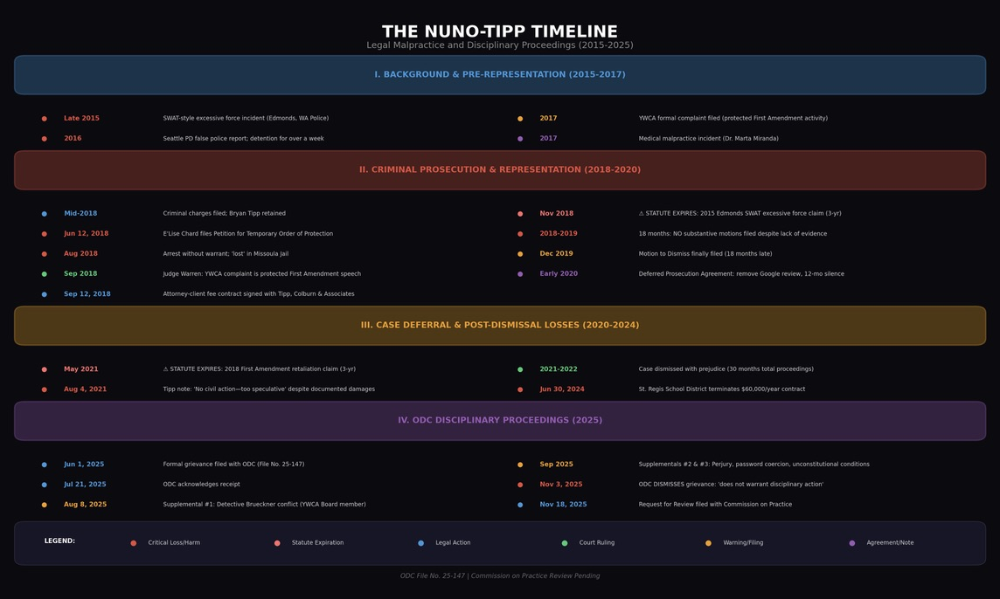

# Bryan Tipp malpractice (2017–2025)

Quick hub: [Bryan Tipp](https://www.ywcaofmissoula.com/overview/bryan-tipp-malpractice-allegations-missed-1983-deadlines-and-source-index).

### Executive snapshot

This page analyzes potential legal-malpractice theories tied to Bryan Tipp’s representation (2017–2025). It focuses on alleged missed limitation periods and alleged failures to advise on civil-rights and tort options. It is a claims-and-damages model, not a disciplinary finding. The broader site-wide Nuno case damages model now separates claimed and conservative figures and includes the second-migration component. Use the **Verify first** links to confirm dates, filings, and what was communicated.



### Verify first (primary artifacts)

* Montana ODC filing index: [ODC 25-147 (Bryan Tipp) — Montana Bar Complaint index](https://www.ywcaofmissoula.com/montana-bar-complaints/odc-25-147-bryan-tipp-montana-bar-complaint-index)
* ODC 25-147 original complaint (PDF): https://arweave.net/LtpoZ8c2hBC4r3ihxMTjdwHCEKk5fdKy31QDhuX92Sk
* ODC denial / request for review packet: https://cr-2025-003-ruling-2\_misjusticealliance.arweave.net/
* Evidence hub: [Legal malpractice evidence (Bryan Tipp)](additional-evidence-and-documentation/missoula-1983-misconduct-mpd-prosecutors-ywca-of-missoula-expanded-history/evidence-related-to-civil-rights-violations-of-mr-nuno-2015-2025/legal-malpractice-evidence-bryan-tipp/)
* Timeline spine (event → record): [Comprehensive Timeline, Relationship Diagram, & Actionable Claims](https://www.ywcaofmissoula.com/comprehensive-timeline,-relationship-diagram,-actionable-claims)
* Primary citations hub: [Sources & record index](https://www.ywcaofmissoula.com/overview/sources-and-record-index)

### What this page covers

* **Jurisdiction:** Montana (with Washington context where it affects accrual and damages)
* **Core question:** whether advice and omissions alleged in filings could satisfy malpractice elements (duty, breach, causation, damages)
* **Practical output:** a structured checklist of alleged omissions, claim-specific limitation issues, suit-within-a-suit causation, and damages evidence

### Key supporting analysis

* ["Generally disinclined": Legal malpractice and First Amendment retaliation (Nuno case)](https://www.ywcaofmissoula.com/additional-evidence-and-documentation/missoula-1983-misconduct-mpd-prosecutors-ywca-of-missoula-expanded-history/evidence-related-to-civil-rights-violations-of-mr-nuno-2015-2025/legal-malpractice-evidence-bryan-tipp/generally-disinclined-legal-malpractice-and-first-amendment-retaliation-nuno-case) (Dec 23, 2020 correspondence + SOL timing; also covers the January 2021 Tyleen Root business-sabotage correspondence and the resulting complete-abandonment analysis — refusal of both the MPD referral letter and civil representation despite full, contemporaneous written knowledge of the harm)
* Evidence hub: [Legal malpractice evidence (Bryan Tipp)](additional-evidence-and-documentation/missoula-1983-misconduct-mpd-prosecutors-ywca-of-missoula-expanded-history/evidence-related-to-civil-rights-violations-of-mr-nuno-2015-2025/legal-malpractice-evidence-bryan-tipp/)

### Applicable standards (high level)

These headings are used as analysis anchors.

Confirm the governing rules against the actual MRPC text and applicable case law.

* **Competence and diligence**: MRPC 1.1 and 1.3
* **Communication**: MRPC 1.4
* **Limitations periods**: varies by claim and accrual theory (confirm per claim)

### Visual timeline (2015–2025)

### Timeline of alleged omissions and limitation issues

The dates below are issue-spotting inputs, not adjudicated accrual dates or legal conclusions. Federal law determines accrual of § 1983 claims; the forum state's personal-injury period is generally borrowed, together with applicable state tolling rules unless inconsistent with federal law. Section 27-2-206 requires a separate malpractice analysis for each alleged act, error, or omission: filing within three years after the plaintiff discovers, or with reasonable diligence should have discovered, that act, error, or omission, whichever occurs last, and in no event more than ten years after it.

| Underlying event | Date presently asserted | Limitation issue requiring record review | Present status |
| --- | --- | --- | --- |
| 2015 Edmonds SWAT raid | Oct. 2015 | Washington claim, party, accrual, tolling, and forum rules must be established | Unresolved; no categorical bar finding |
| 2016 false-arrest allegation | Mar. 2016 | Accrual generally turns on detention/legal-process facts; defendants and tolling remain to be established | Unresolved; allegation documented, deadline not verified here |
| 2017–2021 Missoula prosecution | Charges began in 2017; dismissal date must be verified from the order | Retaliation, unlawful-seizure, and malicious-prosecution theories may accrue at different times; continuing effects do not automatically extend discrete-act claims | Claim-by-claim analysis required |
| 2018 home-entry allegation | Aug. 2018 | Entry, seizure, injury notice, defendants, and any tolling must be proved | Unresolved; no categorical bar finding |
| 2020 witness-intimidation allegation | Feb. 2020 | Conduct, injury, responsible party, accrual, and later related acts require separate treatment | Unresolved; deadline not verified here |

### Element-by-element malpractice assessment

1. **Duty** - Tipp owed fiduciary and professional duties under MRPC 1.1-1.4
2. **Breach** - The cited communications support an argument that limitations advice, scope clarification, or referral was omitted; the complete engagement and defense files remain necessary
3. **Causation** - Requires a suit-within-a-suit showing for each underlying claim: a timely filing opportunity, probable success, collectibility where required, and loss caused by the particular omission rather than another barrier
4. **Damages** - Economic and non-economic losses require admissible source records and an allocation that avoids counting the same injury under multiple underlying theories

### Damages evidence framework

| Category | Legal/evidentiary basis | Calculation input and period | Supported amount | Status |
| --- | --- | --- | --- | --- |
| Lost value of an underlying claim | Requires proof of the underlying claim, timely filing opportunity, causation, defenses, and recoverable value | Claim-specific pleadings, orders, correspondence, comparable outcomes, and expert analysis | Not yet quantifiable from the cited record | Contingent and disputed |
| Past economic loss | Contracts, invoices, tax returns, wage history, mitigation evidence, and source dates | Actual net loss attributable to actionable conduct; exclude overlapping business/reputation theories | Not stated here | Documents referenced but not reconciled |
| Medical and emotional-distress loss | Treatment records, causation testimony, expenses, and admissibility | Past expense plus supported future care; separate from non-economic injury | Not stated here | Partially documented; causation disputed |
| Non-economic loss | Testimony and medical evidence tied to legally cognizable injury | Claim- and period-specific; avoid duplication | Not yet quantifiable | Estimated only after liability and causation proof |
| Punitive damages | Available only if the governing statute and evidentiary standard are satisfied; not a multiplier | No fixed multiple assumed | Not yet quantifiable | Legally contingent |
| Interest, fees, and costs | Depends on judgment, statute, contract, offer-of-judgment rules, and documented expenditures | Calculate only from an identified legal basis and date | Not yet quantifiable | Contingent |

### Risks, defenses, and uncertainties (non-exhaustive)

* **Accrual, tolling, and repose**: each underlying claim requires its own governing law, accrual trigger, statutory or equitable tolling analysis, and any repose rule. A continuing consequence is not necessarily a continuing violation.
* **Malpractice timing**: Mont. Code Ann. § 27-2-206 measures three years from actual or reasonably diligent discovery of the alleged act, error, or omission, whichever occurs last, and includes a ten-year outside repose limit measured from that act, error, or omission. A 2025 discovery assertion does not by itself establish timeliness.
* **Causation**: requires claim-by-claim suit-within-a-suit proof, including liability defenses and a supported valuation.
* **Damages proof**: requires a defensible “but-for” earnings and loss model.
* **Immunities**: many underlying §1983 theories face qualified or absolute immunity issues.

These are case-specific.

They need primary authority review.

### Litigation outlook (non-advice)

* **Timeliness**: No universal 2028 safe date is stated. Calculate § 27-2-206 separately for each alleged act, error, or omission, the date that act, error, or omission was or reasonably should have been discovered, and the ten-year repose cutoff measured from it.
* **Measure of damages**: Recoverable value of an underlying claim and consequential loss must be proved without overlap; allegations and settlement positions are not documented damages.
* **Proof strategy**: The record may require standard-of-care, underlying-liability, causation, and valuation evidence.

_Research current through October 6, 2026. This editorial analysis presents advocacy and disputed allegations, not judicial findings._

### Related


