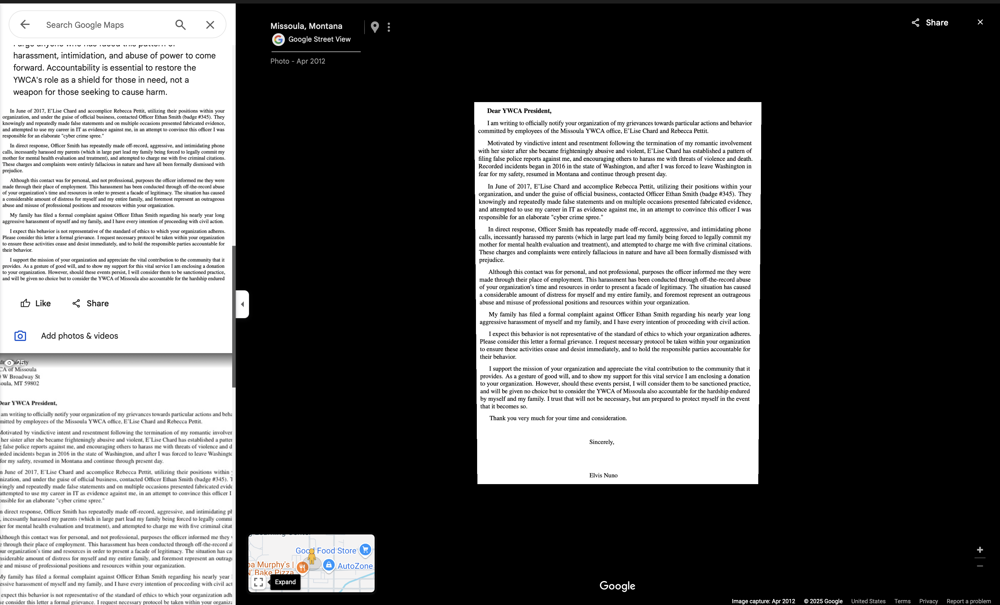

# Ongoing harassment and RICO predicate framing

### Executive snapshot

This page is a sub-index for evidence themes involving alleged ongoing harassment (2019–2025+) and “pattern” framing.

It links to packets, screenshots, and documentation that should be verified directly before drawing conclusions, especially for any racketeering (RICO) theory.



### Verify first (primary artifacts)

* Evidence hub (theme map): [Evidence of Civil Rights Violations, Misconduct, YWCA RICO Predicates, et al](./)
* Timeline spine (event → record): [Comprehensive Timeline, Relationship Diagram, & Actionable Claims](../../../comprehensive-timeline,-relationship-diagram,-actionable-claims.md)
* Primary artifact index: [Police Reports, Court Docs, and Correspondence Index](../../../police-reports,-court-docs,-and-correspondence-index.md)
* CR packet indexes:
  * [CR-2025-001 — Case files index](cr-2025-001-case-files-index.md)
  * [CR-2025-002 — Case files index](cr-2025-002-case-files-index.md)


Avoid publishing private identifiers (addresses, phone numbers, employer HR contacts).

Even if present in a record, redact unless clearly public and necessary.


### CR-2025-001 core packets (public links)

* External case file portal: [https://misjusticealliance.org/cases/d81209a2-206a-426b-a1e6-270169b45d6c](https://misjusticealliance.org/cases/d81209a2-206a-426b-a1e6-270169b45d6c)
* [YWCA institutional RICO dossier (2012–2025)](https://cr-2025-001-other-4_misjusticealliance.arweave.net/)
* [YWCA expanded evidence compilation (2012–2025)](https://cr-2025-001-other-3_misjusticealliance.arweave.net/)
* [Nuno case summary — criminal referral](https://cr-2025-001-brief-2_misjusticealliance.arweave.net/)

### Ongoing harassment evidence (2019–2025+)

#### Operational impacts

* Daily threats: call logs, screenshots, witness statements.
* Professional sabotage: client contact and employment interference.
* Reported continued coordination with local law enforcement.

External packet:

* [Employment interference documentation and client contact records](https://cr-2025-002-evidence-18_misjusticealliance.arweave.net/)

#### Technical indicators

* Social account creation patterns.
* Spoofing/caller ID artifacts.
* IP and network attribution where available and properly preserved.

### RICO predicate framing (evidence-first)

Keep this evidence-driven. Avoid conclusions that require a court finding.

* **Enterprise indicators**: repeated coordination across people and institutions.
* **Pattern indicators**: recurring acts over years, not one-off disputes.
* **Interstate effects**: cross-jurisdiction communication and business interference.

#### Timeline reference



### Key external source links

* [Arthur Brown Google review (screenshot)](https://cr-2025-001-evidence-10_misjusticealliance.arweave.net/)
* [Alleged confidentiality breach (screenshot)](https://cr-2025-001-evidence-21_misjusticealliance.arweave.net/)
* Facebook thread screenshots: [1](https://cr-2025-001-evidence-8_misjusticealliance.arweave.net/) · [2](https://cr-2025-001-evidence-3_misjusticealliance.arweave.net/)
* [Sworn declaration of Elvis Nuno](https://cr-2025-001-evidence-20_misjusticealliance.arweave.net/)

### Appendix A: Photo evidence of continued harassment (August 2022)

These individuals are described in the record as potential associates of E’Lise Chard / YWCA.

The included screenshots/messages contain references that are argued to connect them. Mr. Nuno states they were strangers with no prior contact.

When these incidents were reported, no action was taken.



### Appendix B: Google review content (quoted)

The text below is quoted from a public review.\n\nIt contains allegations and rhetorical language and should be treated as such unless corroborated by primary records. The text below is quoted from a public review.

It contains allegations and rhetorical language and should be treated as such unless corroborated by primary records.

_2 years ago_

Update as of September 22: The harassment I'm facing is escalating, and both the YWCA and MPD are protecting and condoning the perpetrators.

In my previous update on April 22, I mentioned the ongoing harassment from individuals associated with the YWCA. Despite not knowing me personally, they have engaged in stalking and harassment. Shockingly, YWCA's executive director, Cindy Weese, not only condones this behavior but also threatens me for reporting it, defending dishonest reports that have been dismissed by the court.

It's troubling to discover that this organization defends domestic and child abusers if they happen to be women.

Since my return to Missoula five years ago, an YWCA employee named E'Lise Chard, with her close ties to MPD liaison Officer Ethan Smith, has relentlessly stalked and harassed me and my parents. When we filed complaints against Officer Smith, demanding he cease his involvement with Chard, and when I filed a complaint with the YWCA, both organizations responded with shocking retaliation.

They initiated a slander campaign, repeatedly filing and dismissing false stalking charges, justifying the Missoula PD's potential use of force, home raids, false arrests, and attempts to keep me jailed before trial. This weaponization of the legal system orchestrated by the YWCA and Missoula PD devastated my life and my family's, financially bankrupting us.

To this day, E'Lise Chard continues to harass me, with friends posting defamatory statements on my business pages.

What's even more disturbing is that other families, having experienced similar harassment by Chard and the YWCA, have come forward, highlighting a clear pattern of abuse of power. The YWCA has even sent defamatory letters to judges, trying to influence justice.

This is not in line with the YWCA's mission. While they may help some in need, they have lost sight of their purpose and become an organization that destroys families. Unchecked power and lack of oversight have led to this situation, where the YWCA has become a weapon for angry individuals to harm others.

I urge anyone who has faced this pattern of harassment, intimidation, and abuse of power to come forward. Accountability is essential to restore the YWCA's role as a shield for those in need, not a weapon for those seeking to cause harm.

***

**Previous:** [Damages evidence (quantified and non-economic)](damages-evidence-quantified-and-non-economic.md) · **Next:** [MisJustice Alliance case file (d81209a2…)](misjustice-alliance-case-file-d81209a2....md)
