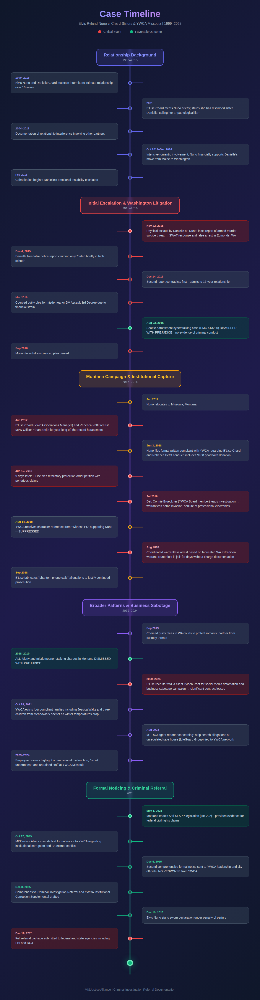

# Comprehensive Timeline, Relationship Diagram, & Actionable Claims

## Master Timeline (2014-2025)

### 2014-2015: Initial Events

* Initial allegations

### 2015-2016: Edmonds & Seattle Proceedings

* Edmonds case begins
* Seattle case begins
* Arrest and excessive bail
* Patricia Fulton representation
* Coerced Edmonds plea entry
* [Seattle case dismissed](https://cr-2024-002-ruling-6_misjusticealliance.arweave.net)
* [Seattle OPA complaint filed](https://cr-2025-002-complaint-10_misjusticealliance.arweave.net/)

### 2016-2017: Appeal Attempts

* [Bar complaint against Fulton](https://cr-2025-002-complaint-14_misjusticealliance.arweave.net/)
* DOH complaint against Dr. Miranda
* [Plea withdrawal attempts](https://cr-2025-002-evidence-9_misjusticealliance.arweave.net/)

### 2017-2018: Montana Involvement

* Move to Montana
* YWCA involvement begins
* E'Lise Chard protection order abuse
* Stalking charges filed

### 2018-2020: Escalation

* Bryan Tipp representation begins
* Misdemeanor and felony charges
* Harassment from YWCA associates
* [Prosecution delays full case dismissal](https://cr-2024-002-ruling-4_misjusticealliance.arweave.net/)
* [MT Case dismissal](https://cr-2024-002-ruling-5_misjusticealliance.arweave.net/)
* Edmonds PD witness intimidation & obstruction of justice
* WA case coerced plea deals&#x20;

### 2020-2025: Federal Filings

* Federal DOJ complaint filed
* FBI report filed
* MT Bar complaint against Tipp
* Ongoing civil rights advocacy

## Relationship Diagram

* YWCA Missoula (Detective Brueckner on board)
* Missoula Police Department
* Prosecutors
* Defense attorneys (Bryan Tipp, Patricia Fulton)
* Accusers and associates

## Actionable Claims Summary

1. 42 U.S.C. Section 1983 violations
2. Legal malpractice
3. Malicious prosecution
4. Defamation
5. Conspiracy to violate civil rights
