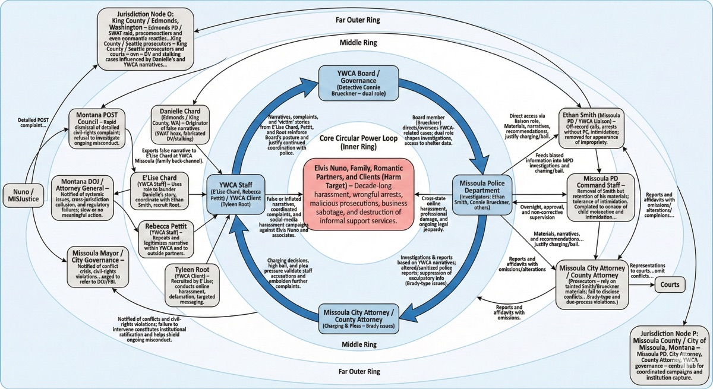

# Comprehensive Timeline, Relationship Diagram, & Actionable Claims

### Executive snapshot

This page is the master **timeline index** for the Nuno record (2014–2025). Each bullet is intended as a waypoint into linked primary artifacts, filings, and focused analysis pages. It also includes relationship diagrams and a high-level “claims map” used for navigation.



### Verify first (primary artifacts)

* Canonical source list: [Sources & record index](https://www.ywcaofmissoula.com/overview/sources-and-record-index)
* Police/court/correspondence index: [Police Reports, Court Docs, and Correspondence Index](https://www.ywcaofmissoula.com/police-reports,-court-docs,-and-correspondence-index)
* Dataset landing page (stable “one URL per record set”): [Dataset: Nuno case civil-rights violations and timeline (2014–2025)](https://www.ywcaofmissoula.com/datasets/dataset-nuno-case-civil-rights-violations-and-timeline-2014-2025)
* Claims overview (analysis): [Civil Rights Violations and Related Claims (2015-2025)](https://www.ywcaofmissoula.com/civil-rights-violations-and-related-claims-2015-2025)


This timeline is an index and claim map. It is not individualized legal advice.


### FAQ (how to use this timeline)

#### What time period does this timeline cover?

It spans 2014–2025 and emphasizes events tied to the Nuno record.

Washington events are included where they connect to later Montana escalation.

#### What does “actionable claims” mean here?

It means claims presented as potentially viable because statutes have not expired, or tolling arguments are asserted.

For claim framing, see [Civil Rights Violations and Related Claims (2015-2025)](https://www.ywcaofmissoula.com/civil-rights-violations-and-related-claims-2015-2025).

#### How should I use the relationship diagram?

Use it to identify potential conflicts, overlapping roles, and recurring actors across agencies.

Start with the embedded diagram and the linked YWCA/MPD/prosecutor nodes.

#### Where do I find the underlying documents for a timeline bullet?

Many bullets link directly to a page that contains the relevant record or analysis.

For broader record navigation, use [Police Reports, Court Docs, and Correspondence Index](https://www.ywcaofmissoula.com/police-reports,-court-docs,-and-correspondence-index).

#### Why include Washington when the misconduct focus is Missoula?

Washington events are used as context for credibility, intent, and cross-jurisdiction pattern indicators.

They also frame later vulnerability and leverage dynamics that appear in Montana.

### 2014-2015: Early events (Washington)

* [Initial allegations and relationship context](https://www.ywcaofmissoula.com/civil-rights-violations-and-related-claims-2015-2025)

### 2015-2016: Edmonds and Seattle proceedings (Washington)

* [Edmonds case begins](https://www.ywcaofmissoula.com/washington-cases/edmonds-case-2015-2017)
* [Seattle case begins](https://www.ywcaofmissoula.com/2015-2016-seattle-case-related-civil-rights-violations)
* [Arrest and excessive bail](https://www.ywcaofmissoula.com/2015-2016-seattle-case-related-civil-rights-violations)
* [Patricia Fulton representation begins](https://www.ywcaofmissoula.com/wa-state-bar-complaint-patricia-fulton-2016): Bar complaint and [legal analysis](https://www.ywcaofmissoula.com/2016-legal-analysis-of-washington-state-bar-complaint-in-re-patricia-fulton)
* [Coerced Edmonds plea entry](https://www.ywcaofmissoula.com/washington-cases/edmonds-case-2015-2017) (see also [plea withdrawal and IAC analysis](https://www.ywcaofmissoula.com/2015-2017-ineffective-assistance-of-counsel-and-plea-withdrawal-in-washington-st))
* [Seattle case dismissed](https://www.ywcaofmissoula.com/2015-2016-seattle-case-related-civil-rights-violations) ([ruling](.gitbook/assets/seattle-case-613225-dismissal.png))
* [Seattle OPA complaint (2016OPA-1167)](https://www.ywcaofmissoula.com/seattle-opa-complaint-2016opa-1167-2016)

### 2016-2017: Appeals and professional complaints (Washington)

* [WA State Bar complaint against Patricia Fulton (2016)](https://www.ywcaofmissoula.com/wa-state-bar-complaint-patricia-fulton-2016)
* [Legal analysis of Bar complaint (In re Patricia Fulton)](https://www.ywcaofmissoula.com/2016-legal-analysis-of-washington-state-bar-complaint-in-re-patricia-fulton)
* [WA Department of Health complaint against Dr. Marta Miranda (2016)](https://www.ywcaofmissoula.com/wa-state-dept.-of-health-complaint-dr.-marta-miranda-2016)
* [Dr. Marta Miranda misconduct analysis and strategic implications](https://www.ywcaofmissoula.com/2016-dr.-marta-j.l.-miranda,-psy.d.-professional-misconduct,-hipaa-violations,-d)
* [Motion to withdraw plea submitted to Edmonds court](https://www.ywcaofmissoula.com/washington-cases/edmonds-case-2015-2017) ([evidence](https://cr-2025-002-evidence-9_misjusticealliance.arweave.net/))
* [Ineffective assistance of counsel and plea withdrawal (WA)](https://www.ywcaofmissoula.com/2015-2017-ineffective-assistance-of-counsel-and-plea-withdrawal-in-washington-st)
* [Plea withdrawal denied by Edmonds Municipal Court](https://www.ywcaofmissoula.com/washington-cases/edmonds-case-2015-2017) (see also [plea withdrawal and IAC analysis](https://www.ywcaofmissoula.com/2015-2017-ineffective-assistance-of-counsel-and-plea-withdrawal-in-washington-st))
* [Mazone law firm retained for appeal](https://www.ywcaofmissoula.com/washington-cases/edmonds-case-2015-2017)
* [Funds exhausted during appeal attempts](https://www.ywcaofmissoula.com/washington-cases/edmonds-case-2015-2017)
* [Forced relocation from Washington due to safety concerns](https://www.ywcaofmissoula.com/state-and-federal-complaints/federal-doj-civil-rights-division-filing-658793-skb-august-2025/fbi-report-filing-pattern-of-cross-jurisdictional-civil-rights-violations-insti)

### 2017-2018: Montana involvement begins (Missoula)

* [Relocation to Montana](https://www.ywcaofmissoula.com/montana-legal-cases)
* [WA appeal of Edmonds decision denied by Superior Court](https://www.ywcaofmissoula.com/washington-cases/edmonds-case-2015-2017)
* [YWCA of Missoula involvement begins](https://www.ywcaofmissoula.com/ywca-complaint-google-reviews;-other-victims-of-ywca-misconduct-2018-2020): complaint record and [board conflict analysis](https://www.ywcaofmissoula.com/legal-analysis-ywca-of-missoula,-board-conflicts,-and-police-integration)
* [Parents file complaint re: Detective Smith harassment](https://www.ywcaofmissoula.com/mt-doj-public-safety-officer-standards-training-post-complaint-august-2025) ([complaint packet](https://cr-2025-002-complaint-16_misjusticealliance.arweave.net/))
* [YWCA complaint plus $400 donation](https://www.ywcaofmissoula.com/ywca-complaint-google-reviews;-other-victims-of-ywca-misconduct-2018-2020): [evidence packet](https://cr-2024-002-evidence-16_misjusticealliance.arweave.net/)
* [YWCA complaint and Google reviews (2018-2020)](https://www.ywcaofmissoula.com/ywca-complaint-google-reviews;-other-victims-of-ywca-misconduct-2018-2020)
* [E'Lise Chard: protection order filing abuse (June 2018)](https://www.ywcaofmissoula.com/elise-chards-abuse-and-manipulation-of-the-protection-filing-system-june-2018): [evidence packet](https://cr-2025-002-evidence-23_misjusticealliance.arweave.net/)
* [Judge Warren rules the YWCA complaint protected First Amendment speech](https://www.ywcaofmissoula.com/montana-legal-cases/stalking-charging-documents-systemic-misconduct-and-evidentiary-failures-septemb)
* [Detective Smith removed for "obvious impropriety"](https://cr-2025-002-complaint-13_misjusticealliance.arweave.net/)
* [Detective Connie Brueckner assigned while serving on YWCA board](https://www.ywcaofmissoula.com/legal-analysis-ywca-of-missoula,-board-conflicts,-and-police-integration)
* [Stalking charges filed and related civil rights violations (2017-2019)](https://www.ywcaofmissoula.com/montana-legal-cases/2017-2019-misdemeanor-felony-stalking-charges-civil-rights-violations-false-imp)
* [Missoula Charging Documents](https://www.ywcaofmissoula.com/montana-legal-cases/stalking-charging-documents-systemic-misconduct-and-evidentiary-failures-septemb)

### 2018-2020: Escalation and case outcomes (Montana and Washington)

* [Bryan Tipp representation begins (malpractice impact overview)](https://www.ywcaofmissoula.com/2017-2025-bryan-tipps-malpractice-its-devastating-impact-on-civil-rights-account)
* Dec 23, 2020: Tipp documents protected speech to prosecutor, then refuses client’s requested institutional letter (“generally disinclined”): ["Generally disinclined": Legal malpractice and First Amendment retaliation (Nuno case)](https://www.ywcaofmissoula.com/additional-evidence-and-documentation/missoula-1983-misconduct-mpd-prosecutors-ywca-of-missoula-expanded-history/evidence-related-to-civil-rights-violations-of-mr-nuno-2015-2025/legal-malpractice-evidence-bryan-tipp/generally-disinclined-legal-malpractice-and-first-amendment-retaliation-nuno-case)
* [Misdemeanor and felony charges filed in Washington (case escalation)](https://www.ywcaofmissoula.com/2020-wa-cases,-witness-tampering,-coerced-pleas,-and-the-impossible-catch-22-sit)
* [Harassment from YWCA-associated individuals (2020-2022)](https://www.ywcaofmissoula.com/threats-malicious-harassment-from-ywca-associates-2020-2022)
* [Missoula PD home invasion, warrantless arrest, and false imprisonment (August 2018)](https://www.ywcaofmissoula.com/home-invasion,-warrantless-arrest,-false-imprisonment;-lost-in-missoula-county-j)
* [Facebook account data warrant (2018)](https://www.ywcaofmissoula.com/fishing-expedition-via-facebook-account-data-dump-search-warrant-2018)
* [Prosecution delays full case dismissal](https://www.ywcaofmissoula.com/montana-legal-cases/2017-2019-misdemeanor-felony-stalking-charges-civil-rights-violations-false-imp) ([ruling](https://cr-2024-002-ruling-4_misjusticealliance.arweave.net/))
* [Montana case dismissal](https://www.ywcaofmissoula.com/montana-legal-cases/2017-2019-misdemeanor-felony-stalking-charges-civil-rights-violations-false-imp) ([ruling](https://cr-2024-002-ruling-5_misjusticealliance.arweave.net/))
* [Edmonds PD witness intimidation and obstruction allegations](https://www.ywcaofmissoula.com/2020-wa-cases,-witness-tampering,-coerced-pleas,-and-the-impossible-catch-22-sit)
* [Washington case coerced plea deals](https://www.ywcaofmissoula.com/2020-wa-cases,-witness-tampering,-coerced-pleas,-and-the-impossible-catch-22-sit)

### 2020-2025: Federal filings and formal grievances

* [Missoula traffic matter, bench warrant escalation, and bondsman seizure (2022–2024)](https://www.ywcaofmissoula.com/missoula-traffic-matter-bench-warrant-escalation-and-bondsman-seizure-2022-2024)
* [DOJ Civil Rights Division filing (August 2025)](state-and-federal-complaints/federal-doj-civil-rights-division-filing-658793-skb-august-2025/)
* [FBI report filing (November 2025)](https://www.ywcaofmissoula.com/state-and-federal-complaints/federal-doj-civil-rights-division-filing-658793-skb-august-2025/fbi-report-filing-pattern-of-cross-jurisdictional-civil-rights-violations-insti)
* [CR-2025-001 — Case files index](https://www.ywcaofmissoula.com/additional-evidence-and-documentation/missoula-1983-misconduct-mpd-prosecutors-ywca-of-missoula-expanded-history/evidence-related-to-civil-rights-violations-of-mr-nuno-2015-2025/cr-2025-001-case-files-index)
* [CR-2025-002 — Case files index](https://www.ywcaofmissoula.com/additional-evidence-and-documentation/missoula-1983-misconduct-mpd-prosecutors-ywca-of-missoula-expanded-history/evidence-related-to-civil-rights-violations-of-mr-nuno-2015-2025/cr-2025-002-case-files-index)
* [Montana Bar complaint re: Bryan Tipp (July 2025)](montana-bar-complaints/mt-bar-complaint-odc-no.-25-147-bryan-tipp-of-tipp-colburn-lockwood-p.c.-july/)
* [MT DOJ POST complaint (August 2025)](https://www.ywcaofmissoula.com/mt-doj-public-safety-officer-standards-training-post-complaint-august-2025)
* [Post-mortem of POST complaint dismissal](https://www.ywcaofmissoula.com/post-mortem-of-mt-doj-post-complaint-dismissal-august-2025)
* [Structural Failure of Police Accountability: MPD to POST](https://www.ywcaofmissoula.com/Structural_Failure_of_Police_Accountability_in_Montana_From_MPD_to_POST)
* [MPD Civilian Complaint Scorecard & Accountability Analysis (2016–2022)](https://www.ywcaofmissoula.com/mpd-civilian-complaint-scorecard-analysis)
* [Remembering When: Missoula Rape Capital Era and Institutional Failures](https://www.ywcaofmissoula.com/remembering-when-mpd,-county-prosecutors,-and-the-ywca-allowed-missoula-to-becom)
* [Forced relocation from Montana due to safety concerns](https://www.ywcaofmissoula.com/state-and-federal-complaints/federal-doj-civil-rights-division-filing-658793-skb-august-2025/fbi-report-filing-pattern-of-cross-jurisdictional-civil-rights-violations-insti)
* [Ongoing civil rights advocacy and documentation](https://www.ywcaofmissoula.com)

## Relationship diagram



* [YWCA board (including Detective Connie Brueckner)](https://www.ywcaofmissoula.com/legal-analysis-ywca-of-missoula,-board-conflicts,-and-police-integration)
* [YWCA staff (E'Lise Chard, Rebecca Pettit)](https://www.ywcaofmissoula.com/ywca-complaint-google-reviews;-other-victims-of-ywca-misconduct-2018-2020)
* [Missoula Police Department](https://www.ywcaofmissoula.com/home-invasion,-warrantless-arrest,-false-imprisonment;-lost-in-missoula-county-j)
* [Prosecutors](https://www.ywcaofmissoula.com/montana-legal-cases/2017-2019-misdemeanor-felony-stalking-charges-civil-rights-violations-false-imp)

See also:

* [YWCA of Missoula: a captured system operating through coordinated institutional failures](https://www.ywcaofmissoula.com/ywca-of-missoula-a-captured-system-operating-through-coordinated-institutional-f)
* [YWCA of Missoula's role in First Amendment violations (2018-2025)](https://www.ywcaofmissoula.com/ywca-of-missoulas-role-in-first-amendment-violations-against-mr-nuno-2018-2025)

## Institutional power-loop diagram

The diagram below maps the alleged "core circular power loop" connecting YWCA governance, YWCA staff, Missoula Police Department investigators, and the Missoula City Attorney/County Attorney's office, together with the outer-ring oversight and referral nodes (Montana POST Council, Montana DOJ/Attorney General, Missoula Mayor/City Governance, and the King County/Edmonds jurisdiction). It is presented as advocacy analysis, not an adjudicated finding.

## Expanded diagram



* [Danielle Chard, accusers, and associates](https://www.ywcaofmissoula.com/civil-rights-violations-and-related-claims-2015-2025)
* [Edmonds and Seattle PD plus Missoula PD (cross-jurisdiction coordination allegations)](https://www.ywcaofmissoula.com/state-and-federal-complaints/federal-doj-civil-rights-division-filing-658793-skb-august-2025/fbi-report-filing-pattern-of-cross-jurisdictional-civil-rights-violations-insti)
* [Defense attorneys: Bryan Tipp and Patricia Fulton](https://www.ywcaofmissoula.com/2017-2025-bryan-tipps-malpractice-its-devastating-impact-on-civil-rights-account) (see also [Patricia Fulton Bar complaint](https://www.ywcaofmissoula.com/wa-state-bar-complaint-patricia-fulton-2016))

## Actionable claims (summary)

1. 42 U.S.C. 1983 (Section 1983) civil rights violations
2. Legal malpractice and ineffective assistance of counsel theories
3. Malicious prosecution
4. Defamation
5. Conspiracy to violate civil rights

## Related topics (quick links)

* [Civil Rights Violations and Related Claims (2015-2025)](https://www.ywcaofmissoula.com/civil-rights-violations-and-related-claims-2015-2025)
* [Edmonds Case (2015-2017)](https://www.ywcaofmissoula.com/washington-cases/edmonds-case-2015-2017)
* [Washington/Montana Legal Cases Index](https://www.ywcaofmissoula.com/washington-montana-legal-cases-index)
* [Police Reports, Court Docs, and Correspondence Index](https://www.ywcaofmissoula.com/police-reports,-court-docs,-and-correspondence-index)
* [Allegations Against YWCA of Missoula and Detective Brueckner](https://www.ywcaofmissoula.com/montana-legal-cases/allegations-against-ywca-of-missoula-board-member-detective-connie-brueckner-pat)
* [Legal analysis: YWCA of Missoula, board conflicts, and police integration](https://www.ywcaofmissoula.com/legal-analysis-ywca-of-missoula,-board-conflicts,-and-police-integration)
* [Seattle OPA complaint post-mortem / legal analysis](https://www.ywcaofmissoula.com/2016-seattle-opa-complaint-2016opa-1167-post-mortem-legal-analysis)
* [Full analysis of Fourteenth Amendment equal protection and due process violations (2015-2025)](https://www.ywcaofmissoula.com/full-analysis-of-fourteenth-amendment-equal-protection-and-due-process-violation)
* [MPD Civilian Complaint Scorecard & Accountability Analysis (2016–2022)](https://www.ywcaofmissoula.com/mpd-civilian-complaint-scorecard-analysis)
* [Structural Failure of Police Accountability in Montana: From MPD to POST](https://www.ywcaofmissoula.com/Structural_Failure_of_Police_Accountability_in_Montana_From_MPD_to_POST)
* [Remembering When: Missoula Rape Capital Era and Institutional Failures](https://www.ywcaofmissoula.com/remembering-when-mpd,-county-prosecutors,-and-the-ywca-allowed-missoula-to-becom)

### Related

