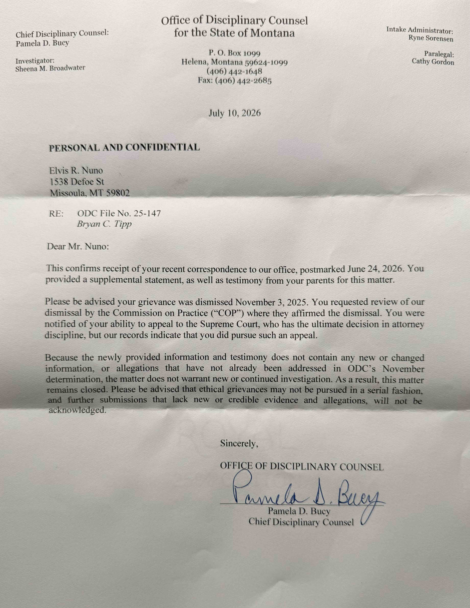



# ODC File No. 25-147 July 2026 Closure Letter — Record and Legal Analysis

## Executive snapshot

On July 10, 2026, the Montana Office of Disciplinary Counsel (ODC) advised Elvis Ryland Nuno that ODC File No. 25-147 would remain closed. The letter acknowledged receipt of correspondence postmarked June 24, 2026, including a supplemental statement and testimony from Nuno's parents. It said the new material contained no new or changed information or allegations not already addressed in ODC's November 2025 determination.

The public record supports a narrower conclusion than either side's strongest characterization. Supplemental Submission #4 expressly presented two exhibit-specific allegations: alleged failure to investigate and use (1) an August 14, 2018 third-party email and (2) an April 10, 2019 letter from Dr. William Stratford concerning psychiatric harm. The July letter did not identify where the November determination addressed either exhibit. But the letter's brevity alone does not establish that ODC failed to review the material: Montana's disciplinary rules give Disciplinary Counsel discretion over the scope of an investigation and require a concise statement of reasons, not allegation-by-allegation findings at the intake stage.


This page analyzes documents and procedural rules. It does not determine whether Bryan C. Tipp violated a professional rule, whether ODC's disposition was legally invalid, or whether any further filing is available. Allegations remain allegations unless independently established.


## Primary records

| Record | Date | What it establishes |
|---|---:|---|
| ODC closure letter reproduced below | July 10, 2026 | ODC's stated reason for leaving the matter closed |
| [Supplemental Submission #4](./mt-bar-complaint-odc-no.-25-147-supplemental-submission-4-may-2026.md) | May 2026 | The two evidence-investigation allegations submitted after the original dismissal |
| [Clarification request regarding the July 10, 2026 letter](./odc-25-147-clarification-request-july-2026.md) | July 2026 | The published follow-up request asking ODC to explain how the two exhibit-specific allegations were treated |
| [ODC dismissal](./mt-bar-complaint-odc-no.-25-147-response-to-bryan-tipp-bar-complaint-answer-octo/mt-bar-complaint-odc-no.-25-147-odc-ruling-november-2025.md) | November 3, 2025 | ODC's original disposition and stated review procedure |
| [Request for Commission on Practice review](./mt-bar-complaint-odc-25-147-right-to-request-review-november-2025/re-grievance-against-bryan-c.-tipp-request-for-review.md) | November 2025 | The complainant's challenge to the original dismissal |

## The July 10 letter

The material language states:

> "Because the newly provided information and testimony does not contain any new or changed information, or allegations that have not already been addressed in ODC's November determination, the matter does not warrant new or continued investigation. As a result, this matter remains closed."

The letter also says that grievances may not be pursued "in a serial fashion" and that further submissions lacking new or credible evidence or allegations will not be acknowledged.

The intended reading, confirmed by Nuno, is that ODC's records indicate he **"did not pursue such an appeal"** to the Montana Supreme Court. The photographed copy appears to omit the word "not." This page uses the confirmed reading while preserving that transcription note so readers can compare it with the image.

## What Supplemental Submission #4 actually added

The submission did not center on expired civil claims or an alleged speech-removal condition. Those theories appear elsewhere in the ODC record. Supplemental Submission #4 instead identified two asserted omissions:

1. **The P.S. email.** The submission alleged that Tipp failed to investigate or use an August 14, 2018 third-party email describing favorable character information and showing that the email was forwarded through YWCA and law-enforcement channels.
2. **The Stratford letter.** The submission alleged that Tipp failed to use an April 10, 2019 psychiatric letter to seek modification of GPS monitoring or other release conditions despite the letter's description of serious psychological harm.

Those are the proper comparison points for evaluating ODC's statement that nothing new was presented. The July letter does not identify a section of the November determination discussing either document. That omission supports a request for clarification. It does not, without the nonpublic disciplinary file or a fuller explanation from ODC, prove that the exhibits were not reviewed.

## Governing disciplinary rules

Montana's current [Rules for Lawyer Disciplinary Enforcement](https://juddocumentservice.mt.gov/getDocByCTrackId?DocId=213755) provide the controlling procedural framework:

* Rule 5(B)(3) directs Disciplinary Counsel to investigate information that, if true, would be grounds for discipline.
* Rules 5(B)(5) and 10(C)(1) authorize Disciplinary Counsel to dismiss a complaint that does not warrant disciplinary action and to conduct the investigation Disciplinary Counsel deems appropriate.
* Rules 5(B)(10) and 10(C)(2) require written notice stating the facts and reasons for dismissal. Rule 5 uses the phrase "concise written statement."
* Rule 10(C)(3) gives a complainant 30 days after a notice of disposition to request Review Panel review. The panel reviews the existing record and may approve, disapprove, or modify ODC's disposition.

These provisions create two competing considerations. ODC has broad discretion over investigative scope. But a dismissal still must state reasons sufficient to identify why the matter was closed. The July letter supplies a reason—no new or changed information—but does not map that conclusion to the two exhibits. Whether that explanation satisfies the rules cannot be determined confidently from the public documents alone, especially because the July letter follows an earlier dismissal and Review Panel proceeding rather than announcing a new Rule 10(C)(2) dismissal.

## Relevant Montana precedent and its limits

No located Montana Supreme Court opinion squarely addresses whether a lawyer-discipline complainant may obtain judicial review after ODC dismisses a supplemental submission following Review Panel action. The closest recent Montana authority arises from a different professional-licensing system.

In *Shreves v. Montana Department of Labor & Industry*, the Montana Supreme Court held that a medical-licensing complainant lacked standing to seek judicial review when the governing statute authorized the screening body only to refer or decline to refer a complaint and did not authorize review at the complainant's request. [*Shreves v. Montana Department of Labor & Industry*, 2024 MT 256, ¶¶ 15–18](https://juddocumentservice.mt.gov/getDocByCTrackId?DocId=495400). The court emphasized that the screening decision did not adjudicate the complainant's legal rights and that the complainant could pursue any independent civil claim through other channels.

*Shreves* is analogous, not controlling. Lawyer discipline is governed by rules promulgated by the Montana Supreme Court, and Rule 10(C)(3) expressly grants an internal Review Panel process that the medical-screening statute in *Shreves* lacked. Still, *Shreves* cautions against describing a disciplinary grievance as the complainant's personal cause of action or assuming that an adverse screening decision necessarily creates a right to judicial review.

The ineffective-assistance cases cited in Supplemental Submission #4 serve a different function. *Strickland v. Washington*, 466 U.S. 668 (1984), and its investigation cases govern constitutional relief from a criminal conviction. They may illuminate professional norms, but they do not by themselves establish an MRPC violation, compel ODC to investigate, or convert this closed grievance into a collateral challenge to the criminal case.

## Record-based assessment

The most supportable criticism is procedural and textual: ODC's July letter does not explain where its earlier determination considered the two exhibits that Supplemental Submission #4 identified. The strongest counterpoint is equally important: the disciplinary rules permit a concise explanation and vest ODC with discretion over investigative scope, while the public record does not reveal the complete file reviewed by ODC or the Commission.

Accordingly, the public documents support saying that the July response **does not show its work as to the two exhibits**. They do not support stating as established fact that ODC ignored the submission, violated due process, or unlawfully refused to investigate.

## Current posture and publication note

The July letter states that the matter remains closed and discourages further repetitive submissions. The rules clearly provided a 30-day Review Panel request from the November 2025 dismissal, and the July letter reports that the Commission affirmed that dismissal. The public materials reviewed for this page do not establish a new 30-day review period triggered by the July correspondence.

Any further procedural step should be confirmed against the complete ODC record and current rules by a Montana-licensed attorney. Public descriptions should link the July letter, Supplemental Submission #4, the November disposition, and the review request so readers can distinguish the source record from commentary.

## Related

* [ODC 25-147 (Bryan Tipp) — Montana Bar Complaint index](./odc-25-147-bryan-tipp-montana-bar-complaint-index.md)
* [Supplemental Submission #4 (May 2026)](./mt-bar-complaint-odc-no.-25-147-supplemental-submission-4-may-2026.md)
* [Clarification Request Regarding July 10, 2026 Letter and Supplemental Submission #4](./odc-25-147-clarification-request-july-2026.md)
* [Tyrone Nuno supporting-witness grievance](./tyrone-nuno-supporting-witness-grievance-odc-25-147-may-2026.md)
* [Eleanor Nuno independent grievance](./eleanor-ellie-nuno-independent-odc-grievance-odc-25-147-may-2026.md)
* [Tipp malpractice and Lowney ODC grievance: civil intake case analysis](./odc-25-147-lowney-case-authorities-analysis.md)
