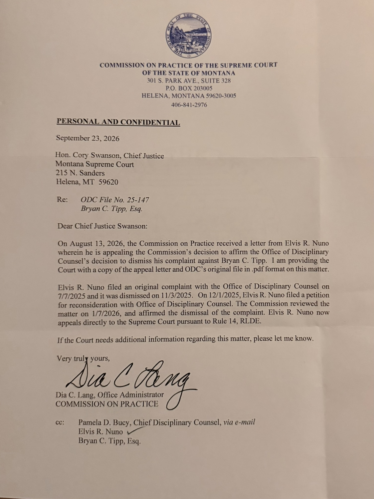



# ODC File No. 25-147 — September 23, 2026 Supreme Court Transmittal

## Executive snapshot

On September 23, 2026, the Commission on Practice of the Supreme Court of the State of Montana sent Chief Justice Cory Swanson a letter concerning **ODC File No. 25-147, Bryan C. Tipp, Esq.** The letter says the Commission received a letter from Elvis R. Nuno on August 13, 2026 “wherein he is appealing the Commission's decision” affirming the Office of Disciplinary Counsel's dismissal. The Commission provided the Court with a copy of Nuno's appeal letter and ODC's original file in PDF format.

The letter therefore resolves one previously open record question: the Rule 14 request was transmitted to the Montana Supreme Court. It does **not** say that the Court granted review, assigned a public docket number, requested briefing, reached the merits, reversed the dismissal, or imposed discipline. Under Rule 14(B) of the Montana Rules for Lawyer Disciplinary Enforcement, Supreme Court review of the Review Panel's disposition is discretionary.


This page distinguishes the letter's procedural statements from interpretation. “Before the Supreme Court” here means the Commission transmitted the written review request and underlying file to the Court. It does not mean the Court accepted review or decided the matter.


## Primary record

The source image is marked “PERSONAL AND CONFIDENTIAL.” It identifies the matter as “ODC File No. 25-147 / Bryan C. Tipp, Esq.” and is signed by Dia C. Lang, Office Administrator, Commission on Practice. The image shows copies to Chief Disciplinary Counsel Pamela D. Bucy, Elvis R. Nuno, and Bryan C. Tipp, Esq.

## What the letter establishes

The September 23 letter expressly records the following chronology:

| Date | Procedural event stated in the letter |
|---|---|
| July 7, 2025 | Elvis R. Nuno filed the original complaint with the Office of Disciplinary Counsel. |
| November 3, 2025 | ODC dismissed the complaint. |
| December 1, 2025 | Nuno filed a petition for reconsideration with ODC. |
| January 7, 2026 | The Commission reviewed the matter and affirmed dismissal of the complaint. |
| August 13, 2026 | The Commission received Nuno's letter appealing the Commission's decision. |
| September 23, 2026 | The Commission sent Chief Justice Cory Swanson the appeal letter and ODC's original file in PDF format. |

The letter concludes: “Elvis R. Nuno now appeals directly to the Supreme Court pursuant to Rule 14, RLDE.” That wording documents the Commission's characterization and transmittal of Nuno's request. It is not itself a Supreme Court order.

## What the letter does not establish

The letter does not establish:

* that the Montana Supreme Court has exercised its discretion to review the Review Panel's disposition;
* that the Court has opened a public case, assigned a docket number, or set a briefing schedule;
* that the Court has made any finding about Bryan C. Tipp's conduct or the merits of Nuno's allegations;
* that ODC's dismissal has been reversed, stayed, or otherwise altered; or
* what action, if any, the Court will take.

Those points require a Supreme Court docket entry, order, or other Court-issued record. None appears in the September 23 Commission letter.

## Rule 14 context

[Rule 14 of the Montana Rules for Lawyer Disciplinary Enforcement](https://juddocumentservice.mt.gov/getDocByCTrackId?DocId=213755) provides the path described in the letter. When a Review Panel affirms Disciplinary Counsel's dismissal, Rule 14(A) permits the complainant to request Supreme Court review in writing to the Commission within the rule's stated period. Rule 14(B) provides that the Supreme Court may review the Panel's disposition “in its sole discretion.”

This makes the September 23 transmittal procedurally significant but limited. It confirms that the request moved from the Commission to the Court through the Rule 14 channel. The next legally meaningful development would be a Court-issued record showing whether and how the Court acted.

## Record reconciliation

Earlier July 10 and July 30, 2026 ODC letters stated that ODC's records indicated Nuno “did pursue” an appeal, but those letters did not disclose its status or disposition. The September 23 letter supplies the missing intermediate fact: the Commission received Nuno's August 13 request and transmitted it, with ODC's original file, to Chief Justice Swanson and the Montana Supreme Court.

The new letter does not resolve every procedural question. In particular, it does not disclose a Supreme Court docket number or a ruling on whether the Court will exercise discretionary review. The accurate public description is therefore: **the request was transmitted to the Montana Supreme Court under Rule 14; Supreme Court action on the request is not established by this letter.**

## Related records

* [ODC 25-147 (Bryan Tipp) — Montana Bar Complaint Index](odc-25-147-bryan-tipp-montana-bar-complaint-index.md)
* [ODC File No. 25-147 — Chronological Case-Record Timeline](odc-25-147-chronological-case-record-timeline-ps-email-chain-index-police-report-comparison.md)
* [ODC File No. 25-147 July 2026 Closure Letter — Record and Legal Analysis](odc-25-147-july-2026-closure-response-analysis.md)
* [The ODC's Technicality Defense — Analysis of the July 30, 2026 Closure Letter](odc-file-no-25-147-july-30-2026-closure-letter-technicality-defense-analysis.md)
* [MT Bar Complaint ODC-25-147 — Right To Request Review](mt-bar-complaint-odc-25-147-right-to-request-review-november-2025/README.md)
