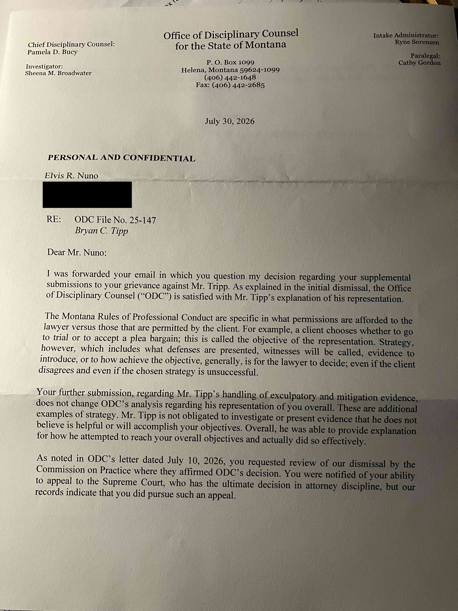



# The ODC's Technicality Defense — Analysis of the July 30, 2026 Closure Letter in ODC File No. 25-147

## Executive Summary

On July 30, 2026, the Montana Office of Disciplinary Counsel issued a final closure letter in ODC File No. 25-147. The letter responds to a complainant email questioning ODC's handling of the May 2026 supplemental submission and largely repeats the same core rationale seen in the earlier July 10 closure correspondence: that the alleged conduct by Bryan C. Tipp is best understood as protected attorney "strategy" rather than a disciplinary violation, and that the criminal matter's dismissal with prejudice confirms adequate representation.

That framing is the problem. The July 30 letter answers the grievance by collapsing discrete allegations into a single outcome-based shortcut. It does not meaningfully engage the alleged conflict-of-interest issue, the removal of an officer for "obvious appearance of impropriety," the alleged warrantless entry and unlawful detention, the withheld or unused witness evidence, the psychiatric harm documented during GPS monitoring, or the repeated allegation that counsel's posture reflected institutional deference rather than independent advocacy.

In this filing sequence, the July 30 letter functions less like a merits-based ethics response and more like a technicality defense: if the matter can be described as "strategy," then the underlying duties of competence, diligence, communication, and conflict avoidance are never individually tested.

## What the July 30 Letter Says

The July 30 letter begins by acknowledging that Chief Disciplinary Counsel Pamela D. Bucy was forwarded an email from Elvis Nuno questioning ODC's handling of the supplemental submission. It then reduces the dispute to a doctrinal distinction between a client's objective and a lawyer's strategy.

Under that framing, ODC says that decisions about witnesses, evidence, and defenses are matters of counsel's discretion, even if the client disagrees and even if the resulting strategy is unsuccessful. The letter then treats the supplemental submission's discussion of exculpatory and mitigation evidence as additional examples of strategy and concludes that Mr. Tipp was able to explain how he pursued the client's overall objectives.

The analytical endpoint is familiar: because the criminal case was dismissed with prejudice, the representation is treated as effective enough to foreclose discipline.

## Why the "strategy" frame is too narrow

The record does not support treating this matter as a pure strategy dispute. Tyrone Nuno's May 2026 supporting-witness grievance states that the case "came to an end only after my ex-wife and I directly demanded that it be resolved" and that this was "a family reaching its limits and forcing a conclusion that should have come much sooner." Eleanor Nuno's independent grievance says the same thing in substance: the case ended only after she and Tyrone directly demanded resolution, not because counsel independently produced a successful result.

That chronology matters. If the case was concluded because the parents finally demanded that it stop, then the outcome does not read as the product of a carefully executed defense strategy. It reads as a pressured ending after a prolonged period of perceived passivity, family exhaustion, and unresolved complaints about evidence, witnesses, and conflicts.

So the real question is not whether some tactical choices existed. It is whether the attorney's overall handling of the matter was competent, diligent, communicative, and loyal enough that a family would not have had to force the conclusion themselves. On that point, the July 30 letter does not engage the record in any meaningful way.

## First Amendment rights are not a bargaining chip

The same record set also raises a different but related problem: the alleged trading of First Amendment rights for prosecutorial leniency. Even if someone tries to describe that as a matter of "strategy," the label does not cure the defect. Constitutional rights are not ordinary bargaining chips, and a waiver that is extracted as the price of leniency belongs in an unconstitutional-condition and professional-ethics analysis, not in a casual strategy narrative.

The American Bar Association's Criminal Justice Standards are explicit on this point. Standard 3-5.8 says a prosecutor should not use a civil waiver to avoid a bona fide claim of improper law enforcement actions, and a disposition conditioned on relinquishing rights requires informed consent and disclosure. That is an ethics rule about seeking justice, not merely getting a case closed.

A related but distinct ABA policy bears on the "strategy" framing itself. In August 2013, the ABA House of Delegates adopted Resolution 113E, opposing plea or sentencing agreements that require a defendant to waive post-conviction claims of ineffective assistance of counsel, prosecutorial misconduct, or destruction of evidence, and urging courts to reject agreements containing such waivers. Resolution 113E is nonbinding national policy, not a disciplinary rule, and it does not by its own terms reach every category of rights surrendered in a plea or non-prosecution negotiation — it is targeted specifically at waivers of the claims listed above. Several state bar ethics authorities go further than the ABA's national resolution and treat this kind of waiver as creating an unwaivable conflict of interest for defense counsel: Florida Bar Ethics Opinion 12-1 holds that a defense lawyer has an unwaivable conflict when advising a client on an offer that requires waiving ineffective-assistance and prosecutorial-misconduct claims, and that a prosecutor may not make such an offer; New York State Bar Association Ethics Opinion 1098 similarly concludes a prosecutor may not ethically condition a plea on waiver of ineffective-assistance claims; North Carolina State Bar RPC 129 and Virginia Legal Ethics Opinion 1857 reach comparable conclusions. Whether any of these specific authorities would extend to the particular waiver terms alleged in this matter is a question this analysis does not resolve; they are noted here because they establish that "the client's case was resolved" does not, standing alone, answer whether a waiver embedded in that resolution was itself an ethical problem independent of the underlying representation's overall competence.

For a source-attributed, instance-by-instance inventory of the specific evidence this case file alleges was suppressed or left unused by both Tipp and prosecutor Brian Lowney — the category of underlying conduct Resolution 113E's "destruction of evidence" prong addresses — see [Evidence Suppression and the ABA Resolution 113E Evidence-Destruction Prong](odc-25-147-lowney-case-authorities-analysis.md#evidence-suppression-and-the-aba-resolution-113e-evidence-destruction-prong) in the merged Tipp/Lowney case-authorities analysis.

The broader point is that when "strategy" is stretched this far, it stops being a principled defense of advocacy choices and becomes an excuse for even the most unethical misconduct.

What the letter does not do is equally important. It does not separately analyze the allegations that matter most to the disciplinary question:

- the alleged conflict involving Detective Connie Brueckner and her YWCA board role;
- the removal of Officer Ethan Smith for "obvious appearance of impropriety";
- the alleged failure to investigate or challenge false statements attributed to Eleanor Nuno;
- the alleged warrantless home invasion and unlawful detention;
- the alleged interception of exculpatory character-witness communication;
- the alleged failure to interview the complainant's parents regarding false statements attributed to them;
- the alleged refusal to send a conflict-of-interest advocacy letter to the police chief;
- the alleged 18-month delay and the concern that institutional cooperation was preferred over vigorous advocacy;
- the deferred-prosecution agreement condition that required removal of protected speech and functioned as a trade of First Amendment rights;
- the practical effect of Mr. Tipp's negotiation choices, which the request-for-review materials describe as benefiting the prosecution and the YWCA of Missoula more than the client's civil-rights position.

That omission matters because these are not all merely tactical questions. Some are threshold duties of competence, investigation, communication, and conflict analysis that must be satisfied before "strategy" even becomes a meaningful label.

The hypocrisy is especially stark on the Connie Brueckner conflict. The request-for-review materials make the point that discovering her YWCA board position would have mattered to any competent defense strategy — and that it was one of the easiest facts in the entire file to uncover, because a basic Google search would have surfaced it in minutes. If Mr. Tipp could have found that conflict with minimal diligence and did not do so, then ODC's effort to rebrand the resulting omission as a mere "strategy decision" does not answer the real complaint; it proves the complaint.

## Rule-by-Rule Analysis

The ODC letter is doctrinally accurate only at a very high level. Yes, lawyers generally control trial tactics while clients control objectives. But the letter stretches that proposition past its useful limit.

| Allegation | Rule implication | Why the issue is not just strategy |
|---|---|---|
| Failure to investigate a known or discoverable conflict | MRPC 1.1, 1.7 | A lawyer cannot strategically avoid discovering a material conflict and then invoke strategy as the excuse |
| Failure to challenge evidence from an officer removed for impropriety | MRPC 1.1, 1.3 | Competence and diligence require testing the reliability of the source, not merely choosing how to present it |
| Failure to interview available parents/witnesses | MRPC 1.1, 1.3, 1.4 | Basic witness investigation and client communication are not optional tactics |
| Refusal to send a conflict letter / "generally disinclined" response | MRPC 1.2, 1.3, 1.4 | This reads more like a personal preference than a tactical judgment |
| Ignoring documented psychiatric harm from GPS monitoring | MRPC 1.1, 1.3 | Mitigation and release-condition advocacy are core obligations, not afterthoughts |
| Alleged failure to challenge unlawful entry / detention | MRPC 1.1, 1.3 | Constitutional challenge is a core defense function when the facts support it |
| Eighteen-month posture of deference | MRPC 1.3, 1.7 | Delay can itself reflect divided loyalty or an incentives problem, not just strategy |

The key point is simple: if ODC labels every omission "strategy," then the strategy doctrine becomes a universal shield against discipline.

## The Procedural History Shows a Pattern

ODC File No. 25-147 did not emerge as a single filing followed by a single response. It developed through a sequence of submissions and agency replies:

1. the original complaint package;
2. the respondent response;
3. the request for review;
4. Supplemental Submission #4;
5. the July 10, 2026 closure letter;
6. the July 30, 2026 closure letter now analyzed here.

At each step, the complainant's filings became more specific, while the agency response became more generalized. Instead of itemized findings, the response chain repeatedly returned to the same broad closure logic: the case ended, therefore the representation was adequate.

That is not allegation-by-allegation review. It is procedural compression.

## Why "The Case Was Dismissed" Is Not Enough

A dismissal with prejudice does not retroactively cure:

- an unexamined conflict of interest;
- a failure to investigate available exculpatory witnesses;
- a failure to challenge harmful pretrial conditions;
- a failure to communicate or advocate on the client's behalf;
- a deferred-prosecution agreement that traded away protected First Amendment speech;
- a gag order or speech restriction that left the complainant unable to publicly defend himself against continuing harassment and defamation;
- a delay structure that may have favored institutional comfort over client urgency and helped drive downstream business and financial losses.

Montana's disciplinary framework does not require a complainant to first obtain civil damages or a separate civil-rights judgment before ODC can review attorney conduct. Nor does a favorable criminal outcome bar discipline if the conduct itself violated the rules.

The July 30 letter never squares with that basic principle. It treats the outcome as dispositive instead of treating the alleged conduct as independently reviewable.

That omission is especially consequential when measured against the November 2025 Request for Review materials, which detail not only the First Amendment waiver embedded in the deferred-prosecution agreement but also the broader extension breakdown: the delay did not materially improve the client's position, but it did protect institutional actors by removing protected speech from public view and preserving the YWCA's preferred narrative. The resulting gag-effect left the complainant unable to defend himself against continuing harassment and defamation, which he alleges contributed to the collapse of his business and losses in the tens of thousands to hundreds of thousands of dollars.

## Relationship to the Earlier July 10 Closure Response

This article should be read alongside the earlier July 10, 2026 closure-response analysis and the July 2026 clarification request. The July 10 letter is the earlier agency response; the July 30 letter is the later restatement of the same posture after the complainant asked for clarification.

The chronology matters because it shows the complaint did not disappear. It was narrowed, restated, and re-presented with more precision. The agency's answer did not become more specific in response.

## Addendum: The Unsubstantiated "Explanation" Problem

A second defect in the July 30 letter is evidentiary, not doctrinal. The letter asserts that Mr. Tipp "was able to provide explanation" for how he reached the client's objectives and that this explanation was sufficient to convert the mitigation and exculpatory-evidence issues into "strategy." Yet neither the July 30 letter nor the July 10 letter reproduces, summarizes, or cites the content of that explanation.

That is a serious problem because the underlying allegations are concrete and falsifiable. The complaint identifies a named conflict involving Detective Connie Brueckner, the removal of Officer Ethan Smith, a communication allegedly intercepted within minutes, and the failure to interview the complainant's parents. An adequate explanation for those issues should be capable of being stated in a way the complainant can test against billing records, correspondence, or contemporaneous file notes. ODC's paraphrase does not provide that transparency.

This is not the same thing as ordinary confidentiality during an active investigation. The letter is a final closure letter that purports to give reasons. If the reason is that counsel "explained" his decisions, the agency should identify the specific document, email, interview note, or other record where that explanation appears, or else it should not treat the explanation as an independently verified basis for dismissal.

The absence of any documentary anchor matters for review. It leaves the complainant being asked to accept ODC's summary conclusion on trust while being denied the predicate facts that would permit rebuttal. That is incompatible with the function of a closure letter that is supposed to support meaningful appeal or further oversight.

The July 30 letter's appeal language is also misleading in practical terms. Being told that an appeal to the Montana Supreme Court exists is not the same as having the actual ability to stage that appeal. A meaningful Supreme Court appeal requires legal resources, and those resources generally come from counsel; here, the record the article discusses shows that no in-state attorney will take the matter, while finding out-of-state counsel licensed in Montana is a substantial and daunting task. So the letter's statement reads less like a genuine remedial pathway and more like a formalistic notification that ignores the real-world barriers to exercising the right.

## The Appeal Language, Quoted Verbatim

The July 30 letter's closing paragraph, reproduced here exactly as printed, illustrates the same lack of precision that runs through the rest of the letter:

> "As noted in ODC's letter dated July 10, 2026, you requested review of our dismissal by the Commission on Practice where they affirmed ODC's decision. You were notified of your ability to appeal to the Supreme Court, who has the ultimate decision in attorney discipline, but our records indicate that you did pursue such an appeal."

Direct image review of both the July 10, 2026 and the July 30, 2026 letters (conducted 2026-09-24) confirms the sentence is printed identically in both, verbatim, with no "not" present in either printing. Per the complainant's own account, the plain reading is accurate: he did in fact submit a request for Montana Supreme Court review of ODC's disposition. The remaining ambiguity is therefore not textual but procedural — ODC has referenced that appeal in writing on at least two separate occasions without ever disclosing, in either letter or in any other document currently in the record, the appeal's docket number, its pending/decided status, or its disposition. That gap leaves the file's true closure status unverifiable from the public record alone: ODC's own letters simultaneously assert "this matter remains closed" and acknowledge an unresolved Supreme Court review that was, per ODC's own text, in fact pursued. Whatever the reason for ODC's silence on that appeal's status, the effect is that a lay reader cannot determine from ODC's correspondence whether File No. 25-147 is fully closed or still procedurally live in a parallel track — a status resolvable only by independent verification against the Montana Supreme Court's own docket. Whatever the letter meant to convey by pairing "but" with "did pursue" rather than disclosing a status, the imprecision compounds the practical appeal-access barrier discussed above: a formalistic notice of a right that cannot even be described accurately in the letter itself is not the same as a meaningful remedial pathway.

## The Companion August 21, 2026 Letter to Eleanor Nuno

The July 30 letter analyzed above was addressed to Elvis Nuno. A separate, related letter addressed to Eleanor ("Ellie") Nuno and dated August 21, 2026 is known to this record only through a legal-analysis memorandum's description and quotation, not through an independently supplied original. According to the memorandum, ODC acknowledged receiving Eleanor Nuno's May 2026 grievance but stated that it was placed into her son's existing file rather than opened as a separate grievance, and that "after considering the information, it did not change our analysis of this matter." The memorandum also quotes the letter as restating that ODC "issued a dismissal on November 3, 2025" following "completion of our investigation of the entire grievance," and that the Commission on Practice "affirmed the decision" on January 7, 2026.

Read together with the July 30 letter to Elvis Nuno, the August 21 letter repeats the same closure logic in a different register: rather than engaging Eleanor Nuno's specific factual account as an independent witness, it treats her submission as additional information folded into an already-closed file. Neither letter, as described, identifies which specific rule provisions apply to each individual allegation, states whether each piece of named evidence was reviewed, or explains what "did not change our analysis" means in relation to any one item.

## Additional Open Questions Raised in the Public-Facing Explainer

A companion public-facing explainer article, prepared from the same underlying record, raises two additional process questions that are not analyzed above and that neither the July 30 nor the August 21 letter resolves:

- **Was the correct evidentiary threshold applied at the intake stage?** The legal-analysis memorandum argues that the applicable disciplinary procedures call for distinguishing a screening-stage "if true" standard from the clear-and-convincing standard used in a formal disciplinary proceeding, and asks ODC to clarify which standard governed the screening decision here. The memorandum does not argue that the submitted material currently proves a violation by any particular standard; it asks whether the correct threshold was applied before a matter is closed without further investigation.
- **How was Eleanor Nuno's independent grievance actually processed?** The record states her submission was placed into her son's existing file rather than opened as a separate grievance, but does not state what authority or policy permitted that, whether she was treated as a grievant with independent standing, or whether a preliminary review specific to her submission occurred.

These are procedural and governance questions, not claims that any particular outcome was legally required, and are presented here as open questions rather than as established facts. See the public-facing explainer article, linked below, for the full discussion, its Chronology Table, and its Claims-to-Sources Table.

## Related records

- [ODC File No. 25-147 July 2026 Closure Letter — Record and Legal Analysis](odc-25-147-july-2026-closure-response-analysis.md)
- [ODC File No. 25-147 – Clarification Request Regarding July 10, 2026 Letter and Supplemental Submission #4](odc-25-147-clarification-request-july-2026.md)
- [RE: GRIEVANCE AGAINST BRYAN C. TIPP REQUEST FOR REVIEW](mt-bar-complaint-odc-25-147-right-to-request-review-november-2025/re-grievance-against-bryan-c.-tipp-request-for-review.md)
- [Eleanor ("Ellie") Nuno Independent ODC Grievance — ODC File No. 25-147 (May 2026)](eleanor-ellie-nuno-independent-odc-grievance-odc-25-147-may-2026.md)
- [What the ODC's Ruling in File No. 25-147 Means — and Why the Response Warrants Further Review](public-article-odc-25-147-what-the-ruling-means-and-why-it-warrants-review.md) — public-facing explainer article
- [When a Disciplinary Complaint Closes: Transparency, Evidence, and Public Understanding](../transparency-and-public-understanding-attorney-discipline.md) — general, anonymized research report on disciplinary transparency
- [When "Strategy" Ends the Inquiry: ODC File No. 25-147 and the Documented Difficulty Securing Counsel](../research-reports-legal-advocacy-and-analysis/when-strategy-ends-the-inquiry-odc-25-147-representation-gap-analysis.md) — investigative review of the "strategy" rationale and a documented representation-gap problem
- [ODC 25-147 (Bryan Tipp) — Montana Bar Complaint Index](odc-25-147-bryan-tipp-montana-bar-complaint-index.md)
- [Tyrone Nuno Supporting Witness Grievance — ODC File No. 25-147 (May 2026)](tyrone-nuno-supporting-witness-grievance-odc-25-147-may-2026.md)


