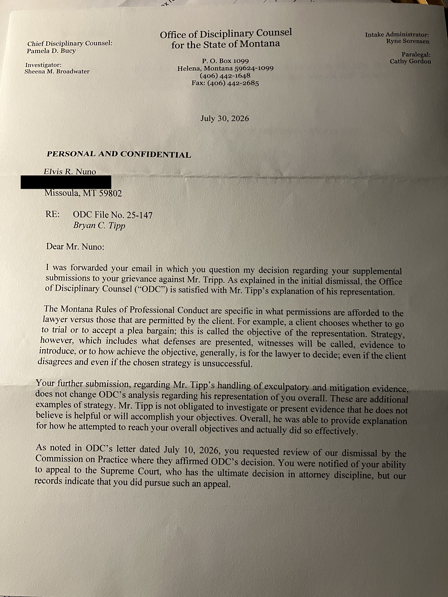



> **Informational, not legal advice.** This article is advocacy-oriented
> public reporting. It does not conclude that any factual allegation is true
> or false, and it does not conclude that any professional-conduct rule was
> or was not violated. Readers with legal questions should consult a
> licensed Montana attorney.

---

## Editorial note on this revision


This article was revised for publication-readiness. It differentiates
allegations, evidence submitted, ODC statements, documented procedural
facts, legal-analysis-memorandum interpretation, and unresolved questions
at every step, and it does not treat an ODC dismissal or closure letter as
proof that any allegation is true or false. One document discussed
here — the August 21, 2026 letter to Eleanor Nuno — is known to this
publication only through a legal-analysis memorandum's description and
quotation, not through an independently supplied original; every statement
about that letter is attributed accordingly.


## What this article reviews

This article reviews documents and submissions made available to this
publication concerning Montana Office of Disciplinary Counsel ("ODC") File
No. 25-147, an attorney-discipline matter involving attorney Bryan C. Tipp.
The documents independently available to this article are:

- A **July 30, 2026** ODC letter addressed to Elvis R. Nuno (reproduced
  below, home address redacted).
- Eleanor ("Ellie") Nuno's **May 2026** independent grievance.
- A legal-analysis memorandum prepared for the family, which describes and
  quotes a separate **August 21, 2026** ODC letter addressed to Eleanor
  Nuno.


[EDITORIAL REVIEW REQUIRED] The August 21, 2026 letter itself was **not**
independently supplied to this publication. Everything this article says
about it is attributed to the memorandum's description, not verified
against the original. Publication should not proceed on points depending
on that letter until the original is obtained.


This article does not conclude that attorney misconduct occurred, that it
did not occur, that ODC's decision was correct, or that it was incorrect.
It asks a narrower question: does the correspondence available to the
public explain, in terms a lay reader and a reviewing body could evaluate,
how later-submitted information was considered?

## The documented procedural timeline

In brief: two ODC decisions in 2025–2026, two separate 2026 letters to two
separate people, and one grievance that postdates the two earlier
decisions. The relationship between the later grievance and the two
earlier decisions is not fully explained in the materials available to
this article. A full chronology table appears at the end of this page.

## What the ODC correspondence says

### The July 30, 2026 letter to Elvis Nuno

This one-page letter, on Office of Disciplinary Counsel letterhead, signed
by Chief Disciplinary Counsel Pamela D. Bucy, responds to a forwarded
supplemental submission questioning ODC's decision. It states that
Montana's Rules of Professional Conduct distinguish a client's
*objectives*, which the client controls, from an attorney's *strategy* —
including which witnesses to call, which defenses to raise, and which
evidence to introduce — which the letter states is generally for the
lawyer to decide, "even if the client disagrees and even if the chosen
strategy is unsuccessful." The letter characterizes the additional
exculpatory- and mitigation-evidence material Elvis Nuno submitted as
"additional examples of strategy," and states that it does "not change
ODC's analysis." It also states that Tipp "was able to provide explanation
for how he attempted to reach your overall objectives and actually did so
effectively."

On the subject of further appeal, the letter's closing sentence reads,
exactly as printed:

> "As noted in ODC's letter dated July 10, 2026, you requested review of
> our dismissal by the Commission on Practice where they affirmed ODC's
> decision. You were notified of your ability to appeal to the Supreme
> Court, who has the ultimate decision in attorney discipline, but our
> records indicate that you did pursue such an appeal."

This sentence is reproduced exactly as printed, without correction, because
it is the letter's own language. Read literally, "but... did pursue" does
not fit the contrastive function of "but," which would ordinarily precede a
negative. This article does not speculate about what was intended; it
flags the wording as ambiguous on its face and leaves the reader to draw
their own conclusion.


[EDITORIAL REVIEW REQUIRED] Confirm whether this sentence reflects a
transcription or drafting issue, or the letter as issued, before treating
either reading as reliable.


### The August 21, 2026 letter to Eleanor Nuno, as described in the legal-analysis memorandum

According to the memorandum, ODC acknowledged receiving Eleanor Nuno's
grievance but stated that it was placed into her son's existing file rather
than opened as a separate grievance, and that "after considering the
information, it did not change our analysis of this matter." The
memorandum also quotes the letter as restating that ODC "issued a
dismissal on November 3, 2025" following "completion of our investigation
of the entire grievance," and that the Commission on Practice "affirmed the
decision" on January 7, 2026.


[EDITORIAL REVIEW REQUIRED] These are the memorandum's quotations of a
letter this article has not independently reviewed. They are not verified
direct quotations for purposes of this article and should not be
republished elsewhere as such until the original letter is obtained.


Neither letter, as described, identifies which specific rule provisions
apply to each individual allegation, states whether each piece of named
evidence was reviewed, or explains what "did not change our analysis"
means in relation to any one item.

## What the grievance and response contend

Eleanor Nuno's May 2026 grievance and the legal-analysis memorandum
together raise several themed allegations. Each is presented here as an
allegation, not a finding, and this publication has not independently
verified any of them:

- **A disputed statement.** The grievance alleges that charging or
  investigative materials attributed statements to Eleanor Nuno about her
  son's mental health, which she denies making, and alleges that Tipp did
  not investigate the attribution or use her account to challenge the
  prosecution's narrative. Whether or how this was addressed in either the
  November 2025 ruling or the two 2026 letters is not established in the
  materials available to this article.
- **A third-party email.** The grievance identifies an August 14, 2018
  email from a person identified as "P.S.," described in the grievance as
  containing favorable character or factual information, and alleges that
  Tipp did not interview the sender or investigate the email. Its treatment
  in ODC's response is not addressed in the materials reviewed here.
- **A psychiatric letter and GPS monitoring.** The grievance identifies an
  April 10, 2019 letter from a psychiatrist, Dr. William Stratford,
  describing alleged psychological harm associated with GPS monitoring
  conditions, and alleges that Tipp did not use it to seek modification of
  release conditions. The memorandum notes that the November 2025 ruling
  reportedly referenced earlier motions filed in December 2018 and an
  assertion that a GPS challenge "would have proven unsuccessful" —
  statements the memorandum raises as a chronological question, since they
  predate the later letter by several months, not as a conclusion about
  what occurred.
- **An officer's removal.** The grievance alleges that an officer was
  removed from involvement in the matter because of an asserted conflict of
  interest, and that Tipp did not investigate, preserve, or use evidence
  related to that removal.
- **Advice on a negotiated disposition.** The grievance challenges the
  advice given about a deferred-prosecution agreement that allegedly
  included restrictions on public speech, removal of online material,
  contact, and continued GPS monitoring.
- **A conflict-of-interest theory.** The grievance separately raises a
  concurrent-conflict theory under Rule 1.7 of the Montana Rules of
  Professional Conduct. The memorandum states the November 2025 ruling
  reportedly treated this as an assertion that Tipp acted in the
  prosecution's interest, and rejected it on the ground that a strategy
  disagreement alone does not establish a conflict.
- **Eleanor Nuno's own submission.** Separately, Eleanor Nuno's May 2026
  filing is described in the memorandum as an independent grievance in its
  own right — not merely supporting material for her son's file — raising
  the same evidentiary allegations from her own vantage point as a witness
  present throughout the representation.

None of these allegations has been independently verified by this article,
and the materials available do not establish what, if anything, ODC found
regarding each one individually.

## Questions the response asks ODC to clarify

The memorandum frames its position as a request for clarification, not a
claim that discipline is required. Its requests, as described in the
memorandum, include:

1. **How was Eleanor Nuno's independent grievance actually processed?** The
   record says her submission was placed into her son's existing file
   rather than opened as a separate grievance, but according to the
   memorandum it does not state what authority or policy permitted that,
   whether she was treated as a grievant with independent standing, or
   whether a preliminary review specific to her submission occurred.
2. **Does the timeline add up?** The memorandum observes that a November
   2025 dismissal and a January 2026 Commission affirmance would not, on
   their face, already have evaluated a grievance filed in May 2026, and
   states that the relationship between the later submission and the
   earlier decisions is not fully explained in the correspondence reviewed.
3. **Does "it did not change our analysis" function as a reasoned
   explanation?** The memorandum argues this phrase states a conclusion
   without identifying whether the new material was outside ODC's
   jurisdiction, untimely, immaterial, contradicted by other evidence,
   found not credible, or cumulative.
4. **Was the correct evidentiary threshold applied at the intake stage?**
   The memorandum argues that the applicable disciplinary procedures call
   for distinguishing a screening-stage "if true" standard from the
   clear-and-convincing standard used in a formal disciplinary proceeding,
   and asks ODC to clarify which standard governed the screening decision
   here. The memorandum does not argue that the submitted material
   currently proves a violation by any particular standard; it asks
   whether the correct threshold was applied before a matter is closed
   without further investigation.
5. **Were the specific, named pieces of evidence actually addressed?** The
   memorandum identifies five discrete items — the disputed statement, the
   third-party email, the psychiatric letter, the officer's removal, and
   the advice on the negotiated disposition — and states that neither
   letter confirms whether each was investigated, what was found, or why
   it did not warrant further action.


[EDITORIAL REVIEW REQUIRED] The specific rule citations underlying these
requests (including any asserted written-reasons requirement and any
asserted review-window deadline) are not independently supplied and are
attributed to the memorandum throughout this section.


## Why clarity in disciplinary communications matters

Independent of what ultimately happened in this file, the underlying
public-interest question is a general one: when a disciplinary body
responds to a follow-up submission with a short letter, how much
explanation is enough for the letter to serve its purpose — informing the
person who filed it, and any later reviewing body, of the basis for the
outcome? This is a governance-and-transparency question that can be
discussed without resolving whether any individual attorney's conduct met
professional standards. It also touches on distinct structural
questions — how complaints from family members and witnesses, rather than
only former clients, are processed; and how a system that relies on
technical distinctions such as "strategy versus objectives" communicates
that distinction to grievants without formal legal training.

## What an ODC disposition does — and does not — decide

An ODC dismissal or closure letter answers a specific, limited
institutional question — generally, whether the information presented
warrants further disciplinary process against a specific attorney under a
specific set of professional-conduct rules. It is not a judicial finding of
fact. A closure does not establish that alleged events did not happen, and
it does not establish that they did. Likewise, a grievance or a
legal-analysis memorandum raising further questions is not proof that
misconduct occurred; it documents an unresolved request for clarification.
The materials available to this article do not disclose which of several
possible considerations — jurisdictional, evidentiary, procedural, or
discretionary — informed the closures described here, and this article
does not guess.

## Requested next steps

Based on the memorandum, and without adopting its conclusions, the
requests attributed to the response include:

1. Clarification of the August 21 letter's procedural status.
2. Clarification of Eleanor Nuno's standing and how her submission was
   processed.
3. A document-specific comparison of what was and was not part of the
   pre-November 2025 record.
4. Clarification of the evidentiary standard applied at intake.
5. Supplemental investigation — or a written explanation of why none is
   warranted — of the disputed statement, the third-party email, the
   psychiatric letter, the officer's removal, and the advice on the
   negotiated disposition.
6. A concise written statement identifying the material facts considered,
   the applicable professional-conduct rules, and the reasons for the
   disposition of each principal allegation.
7. Notice of any further review rights and applicable deadlines.


[EDITORIAL REVIEW REQUIRED] These are presented as the memorandum's
requests, not as this article's conclusions about what ODC owes any
submitter as a matter of law, pending verification of the underlying
procedural-rule citations. These requests ask for clarification and
process, not a predetermined outcome, and do not assert that Mr. Tipp
violated any rule of professional conduct.


## Reader resources and legal disclaimer

If you are in immediate danger, call 911. Individuals seeking support
related to domestic violence, sexual assault, stalking, or coercive control
can contact local domestic-violence, sexual-assault, legal-aid, or advocacy
providers for confidential support and safety planning.

An attorney-disciplinary complaint, a civil lawsuit, a criminal
investigation, and a family-court proceeding are different legal
processes, with different standards of proof, different decision-makers,
and different remedies; resolution or non-resolution in one process does
not resolve the others. A disciplinary dismissal does not resolve — and is
not intended to resolve — the factual truth of any underlying dispute; it
addresses only whether a specific attorney's conduct meets
professional-responsibility standards.

This article does not identify any individual discussed here as a survivor
unless that person has self-identified as such in the supplied materials;
no such self-identification appears in the materials reviewed for this
article. This article is not legal advice. Anyone with questions about
their own legal options should consult a licensed attorney in their
jurisdiction.

## Source documents and editorial methodology

This article is based on: (1) the July 30, 2026 ODC letter to Elvis Nuno,
reproduced above with the recipient's home address redacted; (2) Eleanor
Nuno's independent May 2026 ODC grievance; and (3) a legal-analysis
memorandum describing and quoting an August 21, 2026 ODC letter to Eleanor
Nuno, which was not independently supplied to this publication. Every
material statement in this article is attributed to its specific source;
statements drawn from the memorandum's description of the August 21 letter
are labeled as such throughout and are not presented as independently
verified quotations. Readers seeking the complete procedural history,
including the November 3, 2025 dismissal and the January 7, 2026 Commission
on Practice affirmance, should consult the related-records links below.
See the Claims-to-Sources Table further down this page for a citation
location for each material claim.

## Related records

- [ODC 25-147 (Bryan Tipp) — Montana Bar Complaint Index](odc-25-147-bryan-tipp-montana-bar-complaint-index.md)
- [Eleanor ("Ellie") Nuno Independent ODC Grievance — ODC File No. 25-147 (May 2026)](eleanor-ellie-nuno-independent-odc-grievance-odc-25-147-may-2026.md)
- [Tyrone Nuno Supporting Witness Grievance — ODC File No. 25-147 (May 2026)](tyrone-nuno-supporting-witness-grievance-odc-25-147-may-2026.md)
- [The ODC's Technicality Defense — Analysis of the July 30, 2026 Closure Letter in ODC File No. 25-147](odc-file-no-25-147-july-30-2026-closure-letter-technicality-defense-analysis.md)
- [ODC File No. 25-147 July 2026 Closure Letter — Record and Legal Analysis](odc-25-147-july-2026-closure-response-analysis.md)



---

## Chronology Table

| Date | Document or event | What the available record establishes | Source status |
|---|---|---|---|
| Nov 3, 2025 | ODC dismissal of original grievance | Dismissed a grievance against Bryan C. Tipp; addressed several professional-conduct rules per the memorandum's description | Described in legal-analysis memorandum |
| Jan 7, 2026 | Commission on Practice affirmance | Referenced in the July 30, 2026 letter (as "affirmed the decision") and, per the memorandum, in the August 21 letter | Primary document reviewed (as referenced in July 30 letter) / Described in legal-analysis memorandum (as referenced in Aug. 21 letter) |
| ~May 2026 | Eleanor Nuno's independent grievance | A written submission alleging several specific evidentiary and procedural issues | Primary document reviewed |
| Jul 10, 2026 | Earlier ODC letter referenced within the July 30 letter | Referenced only as a prior letter regarding review by the Commission on Practice | Requires source verification |
| Jul 30, 2026 | ODC letter to Elvis R. Nuno | States ODC's "strategy vs. objectives" reasoning and the ambiguous appeal sentence quoted above | Primary document reviewed |
| Aug 21, 2026 | ODC letter to Eleanor Nuno | Described by the memorandum as stating the grievance was placed in her son's file and did not change ODC's analysis | Described in legal-analysis memorandum |

## Claims-to-Sources Table

| Material claim in revised article | Classification | Supporting source | Citation location | Revision decision |
|---|---|---|---|---|
| Content/quotations of the July 30, 2026 letter | Primary-record fact | July 30, 2026 letter image | Full letter text, as transcribed | Quoted directly, verbatim, including the ambiguous closing sentence |
| Content of the August 21, 2026 letter | Memorandum interpretation | Legal-analysis memorandum | ODC-response.md, quoted passages p. 1 (per memo's internal pincite) | Attributed to memorandum throughout; not treated as independently verified |
| Seven themed allegations (disputed statement, P.S. email, psychiatric letter, officer removal, DPA advice, Rule 1.7 conflict, Eleanor's independent submission) | Allegation | Eleanor Nuno's May 2026 grievance; legal-analysis memorandum | Grievance body; memorandum "MRPC-specific analysis" and "Errors and omissions" sections | Retained as allegations with explicit non-finding caveats added |
| Clear-and-convincing vs. "if true" screening-standard distinction | Memorandum interpretation | Legal-analysis memorandum | Memorandum, "Evidentiary threshold" section | Reframed as the memorandum's argument, not stated procedural fact |
| Written-reasons and review-window requirements | Requires primary-source verification | Legal-analysis memorandum cites MRLDE rule numbers; rule text not supplied | Memorandum, "Applicable standards" section | Attributed to memorandum; flagged for verification against actual rule text |
| Chronological relationship between May 2026 grievance and Nov 2025/Jan 2026 decisions | Editorial analysis / open question | Legal-analysis memorandum | Memorandum, "Chronological inconsistency" section | Reframed from "could not have" to "the relationship is not fully explained" |
| Whether the article's discussion implies a finding of misconduct | Editorial analysis | This revision | "What an ODC disposition does — and does not — decide" section | New section added specifically to prevent this implication |
| Redaction of Elvis Nuno's home address | Primary-record fact (image processing) | Redacted image asset | `.gitbook/assets/odc-25-147-letter-july-30-2026-to-elvis-nuno-redacted.jpg` | Confirmed intact; no change needed |

## Editorial package

**Meta title (≤60 chars):** What the Record Shows: ODC File No. 25-147
(43 chars)

**Meta description (145–160 chars):** A review of the correspondence and
open questions in Montana ODC File No. 25-147 — what the record shows, and
what it doesn't. (129 chars)

**URL slug:** `odc-25-147-what-the-available-record-shows-and-doesnt-show`

**Excerpt (≤45 words):** A review of the correspondence available in ODC
File No. 25-147, distinguishing documented fact from allegation and from
interpretation — and explaining what an attorney-discipline closure does,
and does not, decide. (38 words)

**Keywords:** Montana Office of Disciplinary Counsel; ODC File No. 25-147;
attorney discipline Montana; Bryan Tipp grievance; Montana Rules of
Professional Conduct; attorney disciplinary complaint process; Commission
on Practice; bar complaint transparency

**Facebook/LinkedIn post:** What does a state bar regulator's closure
letter actually decide — and what does it leave open? Our review of ODC
File No. 25-147 walks through the documented timeline, distinguishes
allegation from finding at every step, and explains why clear,
well-explained disciplinary correspondence matters for public trust —
without concluding that misconduct did or did not occur.

**X post (≤280 chars):** A closure letter in a Montana attorney-discipline
case leaves real questions about how later evidence was reviewed. Our
explainer separates documented fact from allegation from interpretation —
and explains what a disposition does, and doesn't, decide.

**Source-document disclosure:** This article is based on the July 30, 2026
ODC letter to Elvis Nuno (reproduced with the home address redacted),
Eleanor Nuno's independent May 2026 ODC grievance, and a legal-analysis
memorandum describing an August 21, 2026 ODC letter to Eleanor Nuno not
independently supplied to this publication. Statements drawn from the
memorandum's description of that letter are labeled as such throughout and
are not independent quotations.
