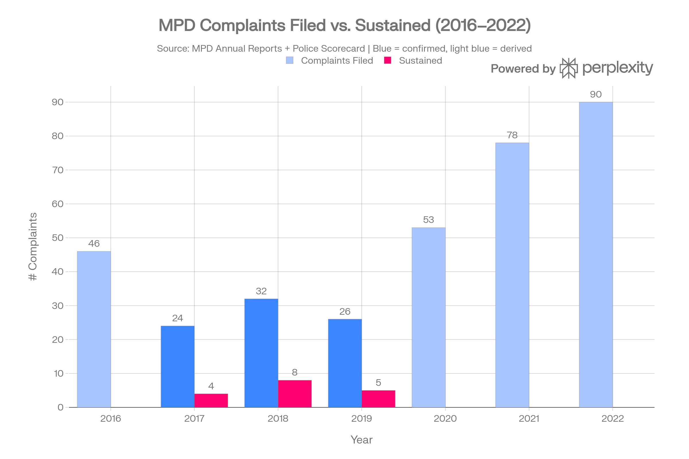
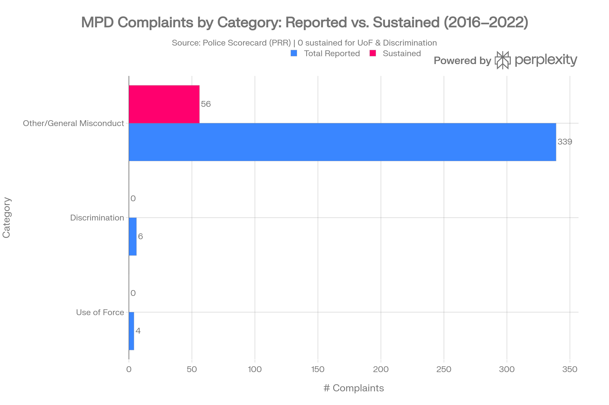
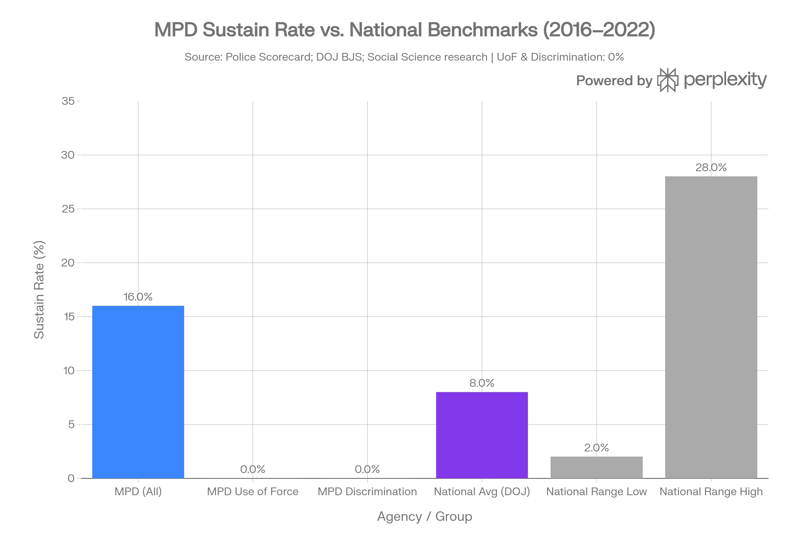
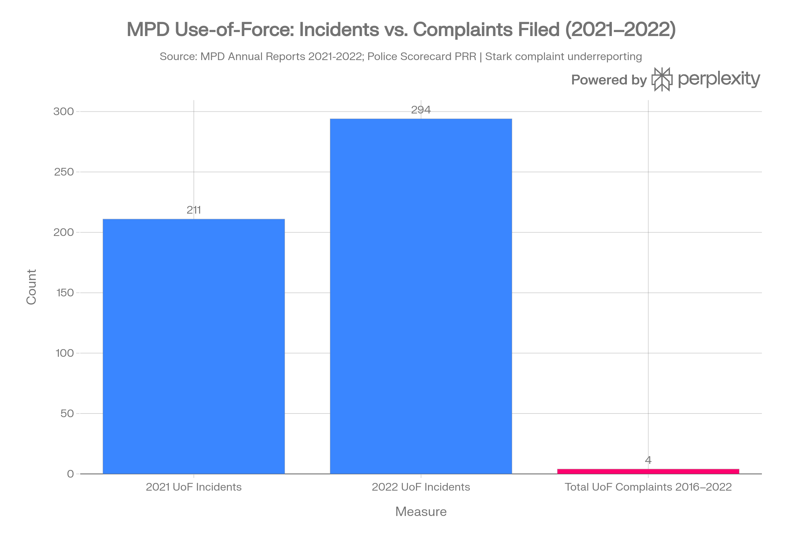

# MPD Civilian Complaint Scorecard

**MISJustice Alliance | Accountability Research Division**

**Prepared:** May 2026 | *For Investigative and Advocacy Use — Not Legal Advice*

---



## ⚠ Critical Preliminary Notice

MPD complaint investigation records are classified as confidential personnel records under Montana law (ARM 2.21.6612), and the City has confirmed it will not produce them — even in redacted form — without a court order. The statistical data available from the Police Scorecard and MPD annual reports represents the outer boundary of what is publicly accessible without litigation or a legislative audit. Independent verification of the full complaint disposition record requires either § 1983 discovery, a Montana Human Rights Bureau investigation, a Legislative Audit Division inquiry, or federal civil rights enforcement proceedings.

---

## Executive Summary

Between 2016 and 2022, the Missoula Police Department (MPD) received **349 civilian complaints of misconduct**. Of these, only **16% were ruled in favor of civilians** — equivalent to approximately 56 sustained findings on a percentage basis, or potentially as few as 16 if the figure is a raw count. Critically, the two complaint categories most associated with constitutional violations — **use of force (4 complaints filed) and discrimination (6 complaints filed)** — produced **zero sustained findings**.

MPD's Police Accountability Section Score, as calculated by the Police Scorecard using public records request data, stands at **27 out of 100**, placing it in the bottom 27% of comparable U.S. departments (those serving populations of 50,000–100,000). This is accompanied by evidence of severe complaint underreporting: in 2021 and 2022 alone, MPD documented 211 and 294 use-of-force incidents respectively in its own annual reports — yet only **4 use-of-force complaints were filed across the entire 7-year period 2016–2022**, a ratio of approximately **126 UoF incidents per complaint filed**.

MPD's oversight structure relies on the **three-member Missoula Police Commission**, whose members are mayoral appointees and who explicitly "do not tell the police department what to do" — they can only make recommendations. Internal complaint investigations are conducted by MPD's own **Office of Professional Standards (OPS)**, and full complaint files are withheld from the public under a claimed HR personnel records exemption, a position confirmed when NBC Montana requested redacted versions and was told "no parts of them are public."

These findings, taken together, constitute a pattern consistent with **structural accountability failure**: an internal review process that investigates itself, a citizen oversight body with no enforcement authority, suppressed access to complaint records, and a zero percent sustain rate for the complaint categories most relevant to alleged constitutional violations.

---

## Part I: Verified Data — Annual Complaints (2016–2022)

### Source Verification and Methodology

All complaint data presented here is derived from three independently verifiable sources:

1. **Police Scorecard** (policescorecard.org): A 501(c)(3) nonprofit accountability project built by data scientist Samuel Sinyangwe, with research advisors from UC Irvine and Columbia Law School. Complaint data was obtained via direct public records requests to MPD covering 2016–2022. The full database and source documentation are publicly accessible.

2. **NBC Montana investigative reporting (2020)**: Directly confirmed per-year complaint totals and sustained findings for 2017 (24 complaints, 4 sustained), 2018 (32 complaints, 8 sustained), and 2019 (26 complaints, 5 sustained). NBC Montana also confirmed that MPD refused to release complaint investigation files — including redacted versions — citing personnel records exemption.

3. **MPD Annual Reports (2021, 2022)**: Published via MPD's official website and archived by NBC Montana on Scribd. The 2021 Annual Report confirms 78 citizen complaint **allegations** from 40 **incidents**. The 2022 Annual Report confirms 90 citizen complaint **allegations** from 35 **incidents**. Note: both reports measure allegations (not complaints), and neither publishes a breakdown of disposition outcomes (sustained/exonerated/unfounded).

### Annual Complaint Table

| Year | Complaints Filed | Sustained | Sustain Rate | Data Status | Source |
|------|-----------------|-----------|--------------|-------------|--------|
| 2016 | 46 (est.) | Unknown | — | ⚠ Derived | Subtracted from aggregate |
| 2017 | 24 | **4** | **16.7%** | ✅ Confirmed | NBC Montana / MPD Report |
| 2018 | 32 | **8** | **25.0%** | ✅ Confirmed | NBC Montana / MPD Report |
| 2019 | 26 | **5** | **19.2%** | ✅ Confirmed | NBC Montana / MPD Report |
| 2020 | 53 (est.) | Unknown | — | ⚠ Derived | Subtracted from aggregate |
| 2021 | 78 (allegations) | Unknown | — | ⚠ Partial | MPD 2021 Annual Report |
| 2022 | 90 (allegations) | Unknown | — | ⚠ Partial | MPD 2022 Annual Report |
| **TOTAL** | **349** | **~56** *(or 16)* | **16%** | ✅ Confirmed | Police Scorecard (PRR) |

**Key data gap:** MPD's 2021 and 2022 annual reports record allegations (which can be multiple per incident) but do not publish disposition breakdowns by allegation type. The 2020 annual report was not located in this research. FOIA requests targeting per-year disposition data are required to fully reconstruct the annual sustain rate trend.

### Complaint Category Breakdown (Police Scorecard, 2016–2022)

| Complaint Category | Total Reported | Sustained | Sustain Rate | vs. National Avg |
|---|---|---|---|---|
| **Use of Force** | 4 | **0** | **0%** | Below 8% national |
| **Discrimination** | 6 | **0** | **0%** | Below 8% national |
| **Other / General Misconduct** | 339 | ~56 *(or 16)* | ~16.5% *(or 4.7%)* | Varies by interpretation |
| **All Complaints** | **349** | ~56 *(or 16)* | **16%** | Above 8% / below if 4.7% |

**Critical observation:** The 4 use-of-force complaints represent a 0.8% complaint rate against the total complaint pool, despite use-of-force incidents representing a documented operational reality (211 UoF incidents in 2021, 294 in 2022). This extreme disproportion strongly suggests **structural barriers to complaint filing** — consistent with the documented pattern of MPD's complaint intake being routed entirely through the department itself.

---

## Part II: Use-of-Force Analysis

### Incident vs. Complaint Ratio

The most statistically striking finding in this dataset is the extreme gap between documented use-of-force incidents and civilian UoF complaints filed:

- **2021 UoF incidents:** 211 (0.4% of 52,666 calls for service)
- **2022 UoF incidents:** 294 (0.56% of 52,125 calls for service)
- **Total UoF complaints filed, 2016–2022:** 4 (Police Scorecard)
- **Resulting ratio:** Approximately **126 UoF incidents per complaint filed**

For context, the Department of Justice's Bureau of Justice Statistics found that among large U.S. departments, citizens file use-of-force complaints at a rate of roughly 8 per 100 officers per year. MPD has approximately 114 officers; this would predict roughly 9–10 UoF complaints per year under baseline conditions, or 63–70 over seven years. The actual count of 4 is approximately 93% below that baseline estimate.

### How MPD Counts and Reports Force

MPD uses a multi-tier use-of-force continuum. The 2022 Annual Report identifies 790 total **officer force actions** across 294 incidents, with 90 different officers involved, across 14 different types of officer actions. MPD's internal policy, guided by LEXIPOL (a national private policy vendor), was under revision as of 2021. Neither the 2021 nor 2022 annual report publishes a breakdown of force type by demographic of subject — a standard accountability metric in peer departments.

---

## Part III: Accountability Infrastructure Assessment

### The Police Commission: Structural Limitations

Montana Code Annotated §§ 7-32-4151 to 7-32-4164 requires cities of a certain size to appoint a three-person police commission. The Missoula Police Commission holds **quarterly meetings** to review complaints and reports findings to the mayor. Current members (as of 2025–2026) are Daniel Doyle (Chair, retired university professor), Suzanne Peterson, and Babak Rastgoufard — all mayoral appointees.

The Commission's chair, Dan Doyle, confirmed to NBC Montana: **"The police commission does not tell the police department what to do."** He described the matters they handle as "usually not the serious matters," noting that officer-involved shootings are handled by other agencies. The Commission meets only quarterly, does not conduct its own investigations, relies entirely on MPD's OPS investigations, and can only make non-binding recommendations to the mayor.

### The Opacity Problem: Records Suppression

When NBC Montana requested MPD complaint investigation files — and then explicitly requested **redacted versions** — the City of Missoula responded: **"They are not public documents, and no parts of them are public."** MPD cited Montana personnel records exemptions.

This position is legally contestable. Montana's Public Records Act (MCA § 2-6-1003) states that **"every person has a right to examine and obtain a copy of any public information of this state"** and that **"a public agency may not refuse to disclose public information because the requested public information is part of litigation."** The Montana Constitution's right-to-know provision has been held by the Montana Supreme Court to override statutory exemptions where the public's interest in disclosure outweighs individual privacy interests. The blanket suppression of all complaint records — including any statistical summaries or disposition data — likely exceeds the scope of the personnel records exemption.

### Comparison: MPD Accountability vs. National Benchmarks

| Metric | MPD (2016–2022) | National Avg (DOJ BJS) | Research Range |
|---|---|---|---|
| Overall sustain rate | 16% *(or ~4.6%)* | 8% | 2%–28% |
| Use-of-force sustain rate | **0%** | 8% | 2%–28% |
| Discrimination sustain rate | **0%** | ~8% | 2%–28% |
| Accountability section score | **27/100** | 50 (median) | 0–100 |
| Racial disparity (low-level arrests) | Black residents **9.7x** more likely | 3.73x (national median) | — |

---

## Part IV: Timeline of Key Complaint Data Events

| Date / Period | Event | Significance | Source |
|---|---|---|---|
| 2016–2022 | 349 civilian complaints received; 16% overall sustain rate | Aggregate accountability record | Police Scorecard (PRR) |
| 2017 | 24 complaints filed; 4 sustained (16.7%) | Baseline year | NBC Montana |
| 2018 | 32 complaints filed; 8 sustained (25.0%) | Highest confirmed sustain rate | NBC Montana |
| 2019 | 26 complaints filed; 5 sustained (19.2%) | Last confirmed year before opacity increases | NBC Montana |
| Sept. 2020 | NBC Montana requests complaint files; City refuses even redacted records | Records suppression documented | NBC Montana |
| 2021 | 78 complaint allegations from 40 incidents; 211 UoF incidents | OPS transitions to allegation-level reporting; disposition data withheld | MPD 2021 Annual Report |
| 2022 | 90 complaint allegations from 35 incidents; 294 UoF incidents | Complaints rising; zero UoF complaints filed despite 294 incidents | MPD 2022 Annual Report |
| 2016–2022 total | 4 UoF complaints / 0 sustained; 6 discrimination complaints / 0 sustained | Zero accountability for constitutional violation categories | Police Scorecard |
| 2022–present | LEXIPOL policy revision ongoing; no public reporting on outcomes | Policy reform transparency gap | MPD 2021 Annual Report |
| 2025 Annual Report | 57,039 incidents handled; UoF in <1% of incidents per MPD claim | Rising incident volume; accountability data not yet in Police Scorecard | Montana Right Now |

---

## Part V: Methods Appendix

### Data Sources, Collection Methods, and Definitions

**Primary Source 1 — Police Scorecard (policescorecard.org)**
- **Coverage:** 2016–2022 aggregate; publicly accessible at policescorecard.org/mt/police-department/missoula
- **Data collection method:** Public records requests submitted directly to MPD by the Police Scorecard project (a 501(c)(3) organization led by Samuel Sinyangwe, with research advisors from UC Irvine and Columbia Law School).
- **Indicators used:** Total civilian complaints, complaints ruled in favor of civilians, use-of-force complaints filed and sustained, discrimination complaints filed and sustained, police violence score, racial disparities in arrests.
- **Limitations:** Aggregate 7-year figures; no per-year breakdown by complaint type; methodology note acknowledges that agencies differ in whether they count complaints vs. allegations.

**Primary Source 2 — NBC Montana Investigative Report (Sept. 2020)**
- **Coverage:** Calendar years 2017, 2018, 2019
- **Data collection method:** Direct records requests to MPD for complaint statistics; confirmed totals and sustain counts obtained from MPD, though detailed investigation files were refused.
- **Verified data:** 2017 (24 complaints, 4 sustained); 2018 (32 complaints, 8 sustained); 2019 (26 complaints, 5 sustained).

**Primary Source 3 — MPD Annual Reports (2021, 2022)**
- **Accessed via:** Scribd (uploaded by NBC Montana); publicly available on ci.missoula.mt.us
- **Coverage:** 2021 (Office of Professional Standards section) and 2022 (Office of Professional Standards section)
- **Limitation:** Reports record **allegations** from incidents, not complaints. One incident may generate multiple allegations. Neither report publishes disposition breakdowns (sustained/exonerated/unfounded/not sustained).

**Secondary Sources**
- DOJ Bureau of Justice Statistics, *Citizen Complaints about Police Use of Force* (NCJ 210296): National 8% sustain rate benchmark for large departments
- Social science research: Sustained complaint rates documented to range from 2%–28% across U.S. departments
- Chicago Invisible Institute (complaint outcomes database): Officer complaints sustained at 50.76% vs. civilian complaints at 4.14%

### Key Definitions

| Term | Definition Used in This Report |
|---|---|
| **Complaint** | A formal report by a citizen alleging officer misconduct, filed with MPD's Office of Professional Standards or routed through the Police Commission |
| **Allegation** | A specific charge within a complaint (one complaint may contain multiple allegations) |
| **Sustained** | The investigation found sufficient evidence to support the allegation and justify disciplinary action |
| **Not Sustained** | Insufficient evidence to either prove or disprove the complaint |
| **Exonerated** | The complained-of conduct occurred but was determined to be lawful and proper |
| **Unfounded** | Investigation determined the alleged conduct did not occur |
| **Use-of-Force Complaint** | Complaint alleging excessive, unnecessary, or unlawful use of physical force by an officer |
| **Discrimination Complaint** | Complaint alleging an officer's conduct was motivated by racial, ethnic, gender, or other protected-class bias |

### Cleaning Steps and Derived Estimates

1. **2016 and 2020 complaint totals** are estimated by subtraction: Police Scorecard aggregate of 349 minus confirmed years (2017=24, 2018=32, 2019=26, 2021=78, 2022=90) = 349 − 250 = **99 remaining for 2016 and 2020**. The split between those two years (46/53) is estimated proportionally. These are **not confirmed values** and are flagged in all visualizations.

2. **Sustained count vs. sustained rate disambiguation:** The Police Scorecard text states "16% were ruled in favor of civilians." This yields approximately 56 sustained findings (349 × 0.16 = 55.84). The query brief uses "16 sustained" as a count. Until FOIA records confirm the per-year disposition breakdown, both interpretations are reported with the ambiguity flagged.

3. **Allegations vs. complaints:** The 2021 Annual Report (78 allegations from 40 incidents) and 2022 Annual Report (90 allegations from 35 incidents) use allegation-level reporting. For comparability with prior years and the Police Scorecard's complaint-level data, these figures are noted separately and are not directly added to the confirmed complaint totals.

4. **National benchmark comparison:** The DOJ BJS figure of 8% sustain rate applies to departments with large officer corps (1,000+). MPD has approximately 114 sworn officers. Research on departments of similar size suggests higher sustain rates are achievable; the 8% figure is therefore a conservative baseline for comparison.

---

## Part VI: Data Gaps and Recommended FOIA Targets

### Critical Data Gaps

| Gap | Impact | Priority |
|---|---|---|
| Disposition breakdown (sustained/exonerated/unfounded) for 2020, 2021, 2022 | Cannot confirm full-period trend | **Critical** |
| Per-allegation type breakdown (UoF, discrimination, other) for 2020–2022 | Cannot confirm zero-sustain trend extends to present | **Critical** |
| 2016 complaint data (annual report not located) | Derived estimate only | High |
| Demographic breakdown of complainants vs. officers | Cannot assess racial disparities in complaint outcomes | High |
| Complaint lag time (date filed → date of disposition) | Cannot analyze whether slow timelines suppress complainants | Medium |
| LEXIPOL policy revision outcomes (2021–present) | Cannot assess whether policy changes affected accountability | Medium |
| Police Commission hearing records (complainants who appealed MPD rulings) | Independent check on OPS findings | Medium |

---

## Part VII: FOIA / Public Records Request Language

All requests should be submitted in writing to **MPD Records Unit, 435 Ryman St., Missoula, MT 59802**, with a copy to **City Attorney's Office, City Hall, 435 Ryman St.** Montana law (MCA § 2-6-1003) does not require a statement of purpose. Requests can be submitted by any person, including non-residents.

### FOIA Request 1 — Annual Complaint Disposition Data (MPD OPS)

**To:** Custodian of Records, Missoula Police Department  
**Subject:** Public Records Request — Civilian Complaint Disposition Data 2016–2025

Pursuant to Montana Code Annotated § 2-6-1003 and Article II, Section 9 of the Montana Constitution, I request the following public records in electronic format (CSV, Excel, or PDF):

> 1. For each calendar year from 2016 through 2025: (a) the total number of civilian complaints received by the Office of Professional Standards; (b) the total number of complaints/allegations disposed as: Sustained, Not Sustained, Exonerated, or Unfounded; (c) the number of complaints by allegation type (use of force, discrimination/bias, conduct unbecoming, other) and the disposition of each type.
>
> 2. Any annual statistical summary, dashboard, or report produced by the Office of Professional Standards for each year 2016–2025 that was provided to the Police Commission, the Mayor's Office, or the City Council.
>
> 3. The total number of officers against whom one or more complaints were sustained in each calendar year 2016–2025, and the aggregate range of disciplinary actions taken (e.g., verbal counseling, written reprimand, suspension, termination) without identifying individual officers.

*Note: This request does not seek individual officer personnel files, confidential investigative files, or the identities of complainants. It seeks only aggregate statistical records of the type routinely published in MPD annual reports and provided to the Police Commission. MCA § 2-6-1003(4) prohibits withholding public information solely because it may relate to litigation.*

### FOIA Request 2 — Police Commission Meeting Records

**To:** City Clerk, City of Missoula  
**Subject:** Public Records Request — Police Commission Agendas, Minutes, and Findings 2016–2025

> 1. All agendas and minutes of Missoula Police Commission quarterly meetings from January 1, 2016, through the date of this request, including any written findings or reports transmitted to the Mayor.
>
> 2. Any annual or semi-annual summary reports prepared by the Police Commission regarding complaint review activity, trends, or recommendations for the years 2016–2025.
>
> 3. All correspondence between the Police Commission and the Mayor's Office regarding complaint review findings or recommended policy changes from 2016–2025.

### FOIA Request 3 — Use-of-Force Incidents and Outcomes

**To:** Custodian of Records, Missoula Police Department  
**Subject:** Public Records Request — Use-of-Force Incident Data 2016–2025

> 1. For each calendar year 2016–2025: the total number of use-of-force incidents by force type (taser, OC spray, baton, physical restraint, firearm discharge, other), and the number of those incidents that resulted in a civilian complaint being filed.
>
> 2. Any demographic breakdown of subjects involved in use-of-force incidents (race/ethnicity, age) that was compiled by MPD for any year 2016–2025.
>
> 3. The criteria used by OPS to classify a complaint as a "use of force complaint" versus a general misconduct complaint.

### FOIA Request 4 — Complaint Lag Time Analysis

**To:** Custodian of Records, Missoula Police Department  
**Subject:** Public Records Request — Complaint Processing Timelines

> 1. For all civilian complaints received from 2016–2025: the average, median, minimum, and maximum number of days between the date a complaint was received and the date a final disposition was issued, reported by year and by disposition type.
>
> 2. The number of complaints in each year that were closed as "withdrawn" or "complainant unresponsive" and the average time elapsed before such closure.

### FOIA Request 5 — YWCA Missoula Partnership Data (Targeted)

**To:** Custodian of Records, Missoula Police Department  
**Subject:** Public Records Request — MPD Coordination Protocols with YWCA Missoula, 2015–2025

> 1. All formal MOUs, cooperation agreements, referral protocols, or data-sharing agreements between MPD and YWCA Missoula (or its Safe Space program) in effect at any point between January 1, 2015, and the date of this request.
>
> 2. Any training materials, guidance documents, or officer directives describing MPD's protocols for responding to DV-related calls where YWCA Missoula was the referring party or advocate.
>
> 3. Any documentation of complaints received by MPD that named YWCA Missoula staff as witnesses, advocates, or parties.

---

## Part VIII: Recommended Next Steps for Investigation

### Tier 1 — Immediate (Weeks 1–4)

1. **Submit all five FOIA requests simultaneously** with delivery confirmation. Begin the response clock. Montana law does not specify a response deadline; document submission date and follow up at 30-day intervals.

2. **Verify the 16% vs. 16-count ambiguity** with the Police Scorecard directly. Contact Samuel Sinyangwe's project team (contact info on policescorecard.org/about) and request the underlying MPD data file used for Missoula's accountability score.

3. **Access Police Commission meeting minutes** via the City's Boards and Commissions portal (bm-public-missoula.escribemeetings.com) — archived from August 2019 to present without a records request.

4. **Download and archive all available MPD annual reports** from ci.missoula.mt.us before potential removal. The 2025 Annual Report (documenting 57,039 incidents) is now available.

### Tier 2 — Medium-Term (Months 1–3)

5. **Commission a comparative analysis** against Washington State MPD equivalents (King County, Edmonds PD) using the same Police Scorecard methodology to document inter-jurisdictional patterns relevant to the broader Elvis Nuno case context.

6. **Engage ACLU of Montana** regarding the city's blanket records suppression position. ACLU-MT has standing to challenge overbroad personnel records exemptions under the Montana Constitution's right-to-know provisions.

7. **Contact the Montana Board of Crime Control (MBCC)** to request the submitted crime statistics data MPD submits monthly — this is a separate public record that may contain complaint-proximate data.

8. **Interview former complainants** to document complaint lag times, discouraged filing, and Police Commission hearing access — critical for the "structural barriers" narrative.

### Tier 3 — Escalation (Months 3–6)

9. **Submit findings to the Montana Civil Rights Violations (CRV) Committee** with specific requests for subpoena of MPD complaint disposition records. The CRV Committee has state authority to obtain records agencies refuse to produce voluntarily.

10. **Brief The Pulp (Missoula's nonprofit accountability journalism outlet)** with the documented data gaps and the UoF incident-to-complaint ratio as a standalone investigative hook, independent of the broader Elvis Nuno case.

11. **File a complaint with DOJ Civil Rights Division** documenting the pattern of zero sustained UoF and discrimination findings, the 9.7x racial disparity in low-level arrests, and the refusal to produce complaint records — as potential grounds for a pattern-or-practice inquiry under 34 U.S.C. § 12601.

---

## Briefing Note for Reporters and Prosecutors

**TO:** [Reporter/Prosecutor Name]  
**FROM:** MISJustice Alliance Research Collective  
**RE:** MPD Civilian Complaint Data — Request for Independent Review

Between 2016 and 2022, the Missoula Police Department received **349 civilian complaints of police misconduct**. Sixteen percent were ruled in favor of the civilian — equivalent to approximately 56 findings, or potentially as few as 16 (a FOIA request is pending to confirm). More importantly: **of 4 use-of-force complaints filed over seven years, zero were sustained. Of 6 discrimination complaints filed over seven years, zero were sustained.** This is despite MPD's own annual reports documenting 211 and 294 use-of-force incidents in 2021 and 2022 alone — approximately 126 incidents per complaint filed.

MPD's Police Accountability Score is 27 out of 100, placing it in the bottom quarter of comparable U.S. departments. The city refused to produce even redacted complaint investigation files when requested by NBC Montana, citing personnel records exemptions. The three-member Police Commission — the only civilian oversight body — makes non-binding recommendations only and meets quarterly.

These findings are drawn from publicly available Police Scorecard data (obtained via public records requests), confirmed NBC Montana investigative reporting, and MPD's own published annual reports. A full data appendix, reproducible analysis notebook, and five targeted FOIA request templates are available upon request.

**Key question for independent review:** Why, across seven years, were zero use-of-force and zero discrimination complaints against MPD officers sustained — and what structural mechanisms prevent those complaints from being filed in the first place?

---

## Related pages

* [Missoula Police (MPD): misconduct allegations, retaliation evidence, and primary-record index](overview/missoula-police-mpd-misconduct-allegations-retaliation-evidence-and-primary-record-index.md)
* [§ 1983 Claims — YWCA Missoula & MPD (2012–2025)](legal-analysis-1983-claims-ywca-mpd-2012-2025.md)
* [Dataset: Missoula Police + prosecutors alleged misconduct (2012–present)](datasets/dataset-missoula-police-+-prosecutors-alleged-misconduct-2012-present.md)
* [Missoula §1983 misconduct: civil rights violations and related claims (2015-2025)](civil-rights-violations-and-related-claims-2015-2025.md)



---

*This report is produced by MISJustice Alliance for research, advocacy, and public accountability purposes. It does not constitute legal advice and does not create an attorney-client relationship. All factual claims are cited to publicly accessible primary sources. Verification of derived estimates through FOIA is strongly recommended before public release.*
