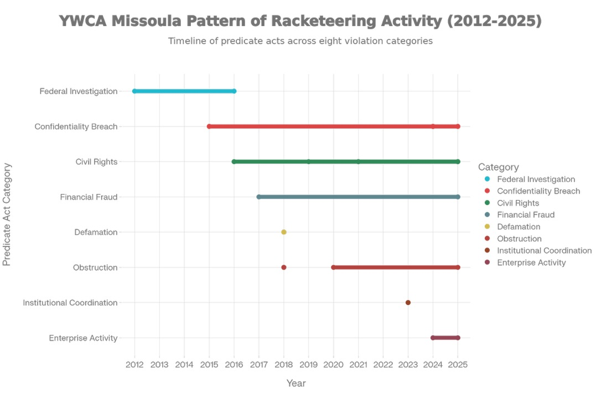

# YWCA of Missoula: captured system overview

### Executive snapshot

This site is a record-first research guide for legal researchers, journalists, civil rights advocates, civil rights attorneys, and individuals trying to navigate the legal system during and directly after being wrongly targeted, charged, prosecuted, or pushed toward coerced plea outcomes in Missoula and adjacent jurisdictions. The Nuno case (2015–2025) is the evidentiary spine that ties together events, filings, complaint responses, institutional actors, and the downstream human and legal costs.



### Verify first (primary artifacts)

* YWCA dataset landing page: [Dataset: YWCA of Missoula alleged misconduct (2012–present)](https://www.ywcaofmissoula.com/datasets/dataset-ywca-of-missoula-alleged-misconduct-2012-present)
* CR-2025-001 key packet (dossier): https://cr-2025-001-other-4\_misjusticealliance.arweave.net/
* Case summary packet (2015–2025): https://cr-2025-002-brief-2\_misjusticealliance.arweave.net/
* MPD complaint packet re: Officer Smith: https://cr-2025-002-complaint-13\_misjusticealliance.arweave.net/
* Timeline spine (event → record): [Comprehensive Timeline, Relationship Diagram, & Actionable Claims](https://www.ywcaofmissoula.com/comprehensive-timeline,-relationship-diagram,-actionable-claims)

The 2024 Missoula Needs and Gaps Analysis is cited here alongside allegations and record citations involving YWCA of Missoula, Missoula Police Department (MPD), and prosecutorial agencies, to argue potential institutional capture and accountability gaps.

Detective Connie Brueckner's simultaneous service on the YWCA of Missoula Board of Directors while investigating complaints against YWCA employees is presented here as a core conflict-of-interest theory.

## Pattern framing used in this analysis

### Example sequence referenced in the record (Nuno case)

The record cited here is used to argue coordination and escalation after complaints. When Mr. Nuno filed a complaint with YWCA leadership regarding staff conduct, this analysis treats later events as potentially relevant to retaliation and conflict-of-interest theories.

The case was transferred from Officer Ethan Smith (removed for obvious conflicts) directly to Detective Brueckner, whose undisclosed YWCA board membership enabled escalating constitutional violations including:

* Warrantless home invasion during a business meeting, resulting in loss of $150,000 annual IT consulting contract
* Mass seizure of electronics and social media data with no evidence found
* 18-month malicious prosecution with charges ultimately dismissed
* Coordinated harassment across multiple jurisdictions

## Legal theories discussed in this analysis

### RICO Violations: Enterprise Corruption

* Pattern of racketeering activity spanning multiple incidents across years
* Enterprise liability for coordinated institutional corruption
* Interstate commerce impact through federal funding and business destruction

The chart above plots the eight predicate-act categories referenced in this analysis — federal investigation, confidentiality breach, civil rights, financial fraud, defamation, obstruction, institutional coordination, and enterprise activity — against the years in which the underlying conduct is alleged to have occurred or continued. It is a pattern-mapping visualization prepared for advocacy purposes and does not represent a judicial or prosecutorial finding of racketeering.

### Civil Rights Conspiracy (42 U.S.C. Section 1985)

* Coordinated deprivation of constitutional rights under color of law
* Interstate coordination between Washington and Montana agencies
* Pattern of retaliation for protected speech activities

## Remediation priorities

If the institutional-capture theory is taken seriously, the fix is not a vague call for “better communication.” The site’s reform pages point to concrete structural changes:

* Remove active law-enforcement and prosecutorial actors from YWCA governance where survivor complaints, referrals, or staff disputes are implicated.
* Separate advocacy intake from police/prosecutor coordination unless survivor-informed consent and written safeguards are documented.
* Create an independent ombuds or external review function for complaint handling, retaliation concerns, and organization-internal disputes.
* Require auditable retention of complaint, referral, and response records so outside review is possible.
* Publish plain-language transparency reporting on governance composition, complaint paths, and policy changes.
* Use written separation-of-functions standards as a condition of continued partnership or funding.

## Conclusion

This page argues that structural incentives and conflicts may prevent internal reform. Any conclusion about liability or criminality should be grounded in primary records and outside investigation.

### Related

